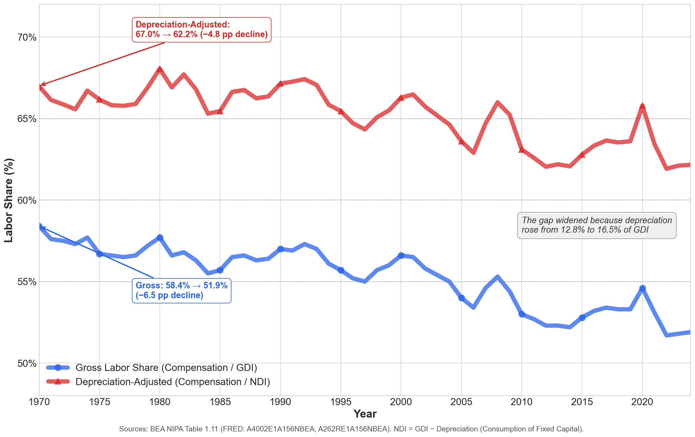
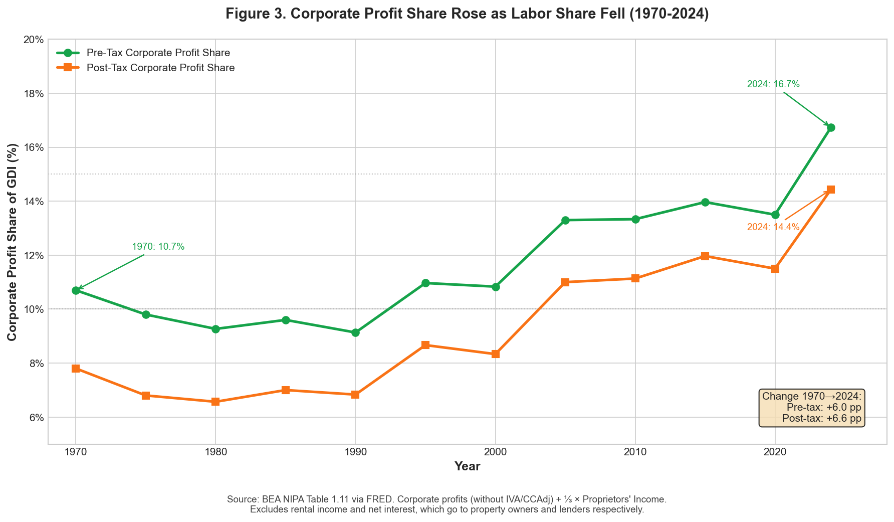

# Has the U.S. Labour Share Declined? A note (v.2)

## Executive Summary

**Has the U.S. labor share declined? Yes.** Across the standard BEA whole-economy measures in Table 1.11, the labor share is below its late-1960s/1970 peak. The decline is consistent across all measures examined here, though magnitude varies with methodological choices (sector scope, proprietors' income treatment, depreciation inclusion). Different measurement choices yield declines ranging from −4.8 pp to −8.9 pp — a substantial range, but all negative.

### Key Findings (1970-2024)

*All series are annual, BEA whole-economy shares from [Table 1.11 via FRED](https://fred.stlouisfed.org/release/tables?rid=53&eid=42211); latest year shown is 2024.*

| Measure | 1970 | 2024 | Change |
|---------|------|------|--------|
| **Gross Labor Share** (Compensation/GDI) | 58.4% | 51.9% | **−6.5 pp** |
| **Wages + Benefits** (excl. employer social insurance†) | 56.1% | 48.9% | **−7.2 pp** |
| **Wages Only** (excl. all supplements) | 51.6% | 42.7% | **−8.9 pp** |
| **Labor Share of Net Domestic Income** (Compensation/NDI) | 67.0% | 62.2% | **−4.8 pp** |
| Depreciation Share | 12.8% | 16.5% | +3.7 pp |
| Employer Social Insurance† Share | 2.3% | 3.0% | +0.7 pp |

*† Employer contributions for government social insurance ([BEA definition](https://www.bea.gov/help/glossary/contribution-government-social-insurance)). This is dominated by FICA (Social Security + Medicare, 7.65% of wages), but also includes smaller programs like unemployment insurance and workers' compensation.*

**Key takeaways:**
- The **standard gross measure** shows a −6.5 pp decline
- On a **net-income (NDI)** basis — where depreciation is treated as a capital cost subtracted before distribution — the decline is less: −4.8 pp
- Looking at **wages only** (excluding benefits and payroll taxes) shows the steepest decline: −8.9 pp

**Sector scope:** This analysis uses **whole-economy GDI shares**, which include the government sector (employees paid by government) and housing sector (imputed rent from owner-occupied housing). Government tends to *raise* measured labor share (government has little measured operating surplus), while owner-occupied housing tends to *lower* it (adds imputed rental income with no compensation). The [BLS nonfarm business sector](https://fred.stlouisfed.org/series/PRS85006173) — which excludes these sectors — shows an even steeper decline (~16% from its early-1970s peak).

---

## Defining the Labor Share

The "labor share" is the fraction of national income that accrues to workers as compensation for their labor, as opposed to capital owners (profits, interest, rent). This section defines the key concepts.

### The Basic Definition

The **gross labor share** is defined as:

```
                    Compensation of Employees
Gross Labor Share = ─────────────────────────────
                    Gross Domestic Income (GDI)
```

This is the standard measure used in the literature ([Karabarbounis & Neiman 2014](https://www.nber.org/papers/w19136), [Autor et al. 2020](https://www.nber.org/papers/w23396), [Elsby et al. 2013](https://www.brookings.edu/articles/the-decline-of-the-u-s-labor-share/)).

### What Goes Into the Numerator?

**Compensation of Employees** (BEA series A4002E1A156NBEA) includes:

1. **Wages and Salaries**: Cash payments to workers before personal income taxes
2. **Supplements to Wages and Salaries**:
   - *Employer contributions for employee pension and insurance funds* (~6% of GDI): Health insurance, 401(k) contributions, life insurance
   - *Employer contributions for government social insurance* (~3% of GDI): Dominated by Social Security and Medicare payroll contributions (FICA, ~7.65% of wages), plus other government social insurance programs (unemployment insurance, workers' compensation, etc.)

This is a **pre-personal-income-tax** measure of total labor cost to employers. It does *not* include the employee's portion of FICA or personal income taxes — those are paid out of wages received.

### What Goes Into the Denominator?

**Gross Domestic Income (GDI)** is the sum of all incomes earned in production. At the **Table 1.11 level**, the identity is:

```
GDI = Compensation of Employees
    + Net Operating Surplus (NOS)
    + Taxes on Production and Imports less Subsidies
    + Consumption of Fixed Capital (Depreciation)
```

Where **Net Operating Surplus** is itself composed of:
- Corporate Profits (with IVA and CCAdj)
- Proprietors' Income
- Rental Income of Persons
- Net Interest and Miscellaneous Payments

This structure matters: the four NOS subcomponents are not independent. In particular, "Net Interest" is an offset item (see below), not a standalone income measure.

We use GDI rather than GDP because the labor share numerator (compensation) comes from the income side of the accounts. Using GDP would mix income-side numerators with expenditure-side denominators, introducing measurement noise from the statistical discrepancy.

### The Net Domestic Income (NDI) Measure

A key methodological choice is whether to measure factor shares over **gross** or **net** income. **Depreciation** (Consumption of Fixed Capital, CFC) represents resources that must be set aside to replace worn-out capital — it is not income available for distribution to workers or capital owners.

**The distributional logic (capital-first):**

Depreciation is a **capital maintenance cost**. Moving from **gross** to **net** income subtracts depreciation from the denominator (total domestic income) **before** dividing the income between labor and capital. This automatically raises the labor share (dividing labor income by a smaller number). Therefore:

1. Depreciation **reduces** capital's net income and in turn the net capital income share 
2. Labor's *higher* share of net income is then the residual consequence of the now smaller net-income pie

The accounting identities make this explicit:

```
Gross income identity (Table 1.11):
  GDI = Compensation + Net Operating Surplus + Taxes on Production + Depreciation

Net income identity (distribution-relevant):
  NDI = GDI − Depreciation = Compensation + Net Operating Surplus + Taxes on Production
```

On a net basis, depreciation has already been netted out of capital's claim; labor's higher share is the corollary of measuring the split over net income.

Following [Bridgman (2018)](https://bea.gov/papers/pdf/laborshare1410.pdf) and [Rognlie (2015)](https://www.brookings.edu/wp-content/uploads/2016/07/2015a_rognlie.pdf), we compute labor's share of **Net Domestic Income (NDI)**:

```
                                   Compensation of Employees
Labor Share of Net Income (NDI) = ────────────────────────────────────────
                                   GDI − Depreciation (= NDI)
```

**Terminology note:** In the labor share literature, "net" typically means *net of depreciation*, **not** net of taxes. All measures in this document are pre-income-tax.

Equivalently, if we measure labor's share over net income (NDI), the labor-share ratio rises mechanically because the denominator excludes depreciation. The NDI-basis measure shows a smaller decline than the gross measure because depreciation has risen substantially (from 12.8% to 16.5% of GDI). We are measuring labor's share of *sustainable, consumable income* rather than gross output.

### Alternative Numerator Definitions

We also examine alternative numerator definitions to isolate different components:

| Numerator | What It Measures | Interpretation |
|-----------|------------------|----------------|
| **Total Compensation** | Wages + all supplements | Total cost of employing labor |
| **Wages + Benefits (excl. employer social insurance)** | Wages + employer pension/insurance | Excludes employer payroll taxes |
| **Wages Only** | Cash wages before taxes | Excludes all non-cash compensation |

The choice of numerator matters: wages alone have fallen more steeply than total compensation because rising employer benefits and payroll taxes have partially offset wage stagnation.

---

## Figures

### Figure 1. Labor Share Declined Across All Measures Since 1970 Peak


Figure 1 shows five different ways of measuring labor's share of national income, all using GDI as the denominator but varying the labor income numerator (the top of the equation). Each line represents a different definition of "labor income."

- **BEA Total Compensation**: Blue line. The standard gross labor share. The numerator is total compensation of employees (wages + supplements). This is the benchmark measure used in most academic literature.

- **Wages + Benefits (excl. employer social insurance)**: Pink line. The numerator excludes employer contributions for government social insurance (~3% of GDI, dominated by FICA) while keeping private benefits.

- **Penn World Table (1970–2019 only)**: Green lines. Uses a different methodology that imputes a labor share for self-employed workers, rather than treating proprietors' income as mixed. *Note: PWT data ends in 2019; the line does not extend to 2024.*

- **Adjusted: Includes ⅔ Proprietors' Income**: Purple line. Adds two-thirds of proprietors' income to the numerator, following [Gollin (2002)](https://web.williams.edu/Economics/wp/Gollin_Getting_Income_Shares_Right_working_paper_with_figures.pdf), to account for the labor component of self-employment income.

- **Wages Only**: Amber line. The numerator is just wages and salaries — no benefits, no employer payroll taxes. This shows the steepest decline.

**Interpretation:** All measures show a decline from 1970 to the latest available year (BEA series through 2024; Penn World Table through 2019). The magnitude varies: the decline is −6.5 pp for the standard measure, but −8.9 pp for wages only. This means that rising employer contributions to benefits and payroll taxes have partially masked wage stagnation. If you care about workers' cash wages, the decline is steeper than the headline labor share suggests.

Next, we move on to the importance of adjusting total income for depreciation. 

**Terminology note:** In the labor share literature, "net" means *net of depreciation* (using NDI as denominator), **not** net of taxes. All measures in this document are pre-income-tax.

### Figure 2. Labor Share of Net Income (NDI) Also Declined, But Less Steeply



Figure 2 shows the same total employee compensation (numerator) but divided by two different denominators: one is gross (GDI) the other is net (NDI), meaning depreciation of fixed capital has been deducted. 

Depreciation is a capital maintenance cost — it represents wear and tear on machinery, software, and buildings. Depreciation is not income available for consumption — it represents capital maintenance costs. If you want to know labor's share of *sustainable, distributable income*, the NDI measure is more appropriate. But the decline is real under both measures. The NDI-basis measure shows a smaller decline though (−4.8 pp vs −6.5 pp for gross). 

The standard measure of total income does not exclude depreciation (Blue line) - hence GDI. This contrasts with the red line (net domestic income), whereby depreciation is removed as income from the economy leading to the labour share of income increasing as it is divided by a smaller amount. It is a mechnical relationship. Labor's higher net-income share is the residual result. The gap between two lines has widened. In 1970, depreciation was 12.8% of GDI; by 2024, it had risen to 16.5%. As the depreciation share grew, the difference between GDI and NDI widened. This made labor's share of NDI rise *relative to* the gross labor share — even though both declined in absolute terms.


Next, Figure 3 shows the share of national income going to capital owners, computed as a residual after subtracting labor compensation, depreciation, and taxes on production from GDI. 

### Figure 3. Capital Share Rose as Labor Share Fell



All three lines include exactly **⅓ of proprietors' income** (the capital portion per Gollin 2002), making them consistent with the Gollin-adjusted labor share in Figure 1.

**The equation:**
```
Capital Share = NOS − (⅔ × Proprietors' Income)
              = GDI − Compensation − Depreciation − Taxes on Production − (⅔ × Prop)
```

- **Pre-Tax Total Capital Share (Green)**: Capital share before corporate income taxes. This rose from 16.9% (1970) to 20.2% (2024), a +3.3 pp increase. This includes interest and rent income and is defined as Net Operating Surplus minus ⅔ of proprietors' income (leaving ⅓), before corporate income taxes.

- **Post-Tax Total Capital Share (Orange)**: As above, but now subtracting taxes on corporate income. Still shows an increase, though smaller.

- **Corporate Profit (Dashed indigo)**: My preferred measure. Properly excludes rent and interest income, which are expenses. Corporate profits (with IVA and CCAdj) plus ⅓ of proprietors' income. This rose from 9.8% (1970) to 13.8% (2024), a +4.0 pp increase. This likely reflects increased profit margins, market concentration, globalization and technological change, and the rise of high-margin technology firms.

**Key Point:** As labor's share of GDI fell by 6.5 percentage points, capital's share (Gollin-adjusted) rose by about 3.3 percentage points. The remainder was absorbed by rising depreciation (+3.7 pp) and a small decrease in taxes on production.

---

For detailed methodological notes, data tables, replication code, and technical appendices, see **[METHODOLOGY.md](METHODOLOGY.md)**.

---

## License

This research note is shared for educational and research purposes. Data sources are public domain (BEA, BLS) or citation-requested (Penn World Table).

---

## Author

Research note compiled by Ilan Strauss using [Claude Code](https://claude.ai/code). Thank you to Rob Petersen for helpful feedback and clarifying discussions. All errors are my own.

January 2026

---

## Changelog

### v.2.1 (January 2026)
- **Terminology:** Renamed "Depreciation-Adjusted Labor Share" → "Labor Share of Net Domestic Income (NDI)" throughout to avoid implying depreciation "adjusts" labor
- **Exposition:** Rewrote depreciation sections to present the **capital share effect as logically prior** — depreciation reduces capital's net income first; labor's higher NDI share is the consequence
- **Accounting identities:** Added explicit GDI and NDI identities to make the distributional logic unambiguous
- **Links:** Fixed 5 broken academic links (Gollin, Bridgman, Koh et al., BEA handbook/update) with working alternatives


