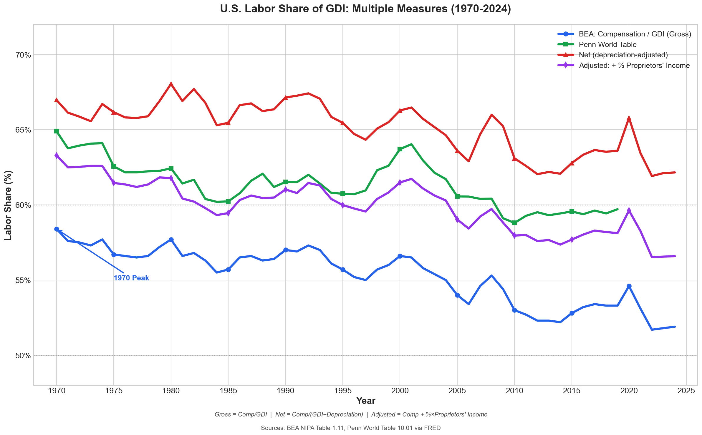

# U.S. Labor Share of GDI: A Methodological Note

## Executive Summary

**The "declining labor share" narrative is highly measurement-sensitive.** Different measurement approaches yield dramatically different conclusions about whether labor's share of national income has declined.

### Why This Note Uses GDI, Not GDP

When measuring labor's share of national income, we must choose a denominator: **GDP** (Gross Domestic Product) or **GDI** (Gross Domestic Income). This note uses GDI. Here's why.

**GDP measures production; GDI measures income.** In theory, they should be identical — every dollar of output generates a dollar of income. In practice, they differ by a "statistical discrepancy" arising from measurement error (often around ~1% of GDP, sometimes larger).

**Labor share data comes from the income side.** The BEA series we use — compensation of employees, corporate profits, proprietors' income, depreciation — are all components of GDI. When FRED reports "Shares of gross domestic income: Compensation of employees," the BEA/FRED series is *defined as* compensation as a percent of GDI. The data is constructed as GDI shares.

**Using GDP as denominator introduces noise.** If you compute `Compensation / GDP` instead of `Compensation / GDI`, you're dividing an income-side numerator by an expenditure-side denominator. When GDP > GDI (positive statistical discrepancy, per [BEA's definition](https://www.bea.gov/research/papers/2007/statistical-discrepancy): discrepancy = GDP − GDI), you'll get a *lower* labor share than the true income-based measure. When GDP < GDI (negative discrepancy), you'll get a *higher* one. Neither reflects the actual income distribution — it just reflects measurement error in the accounts.

**The practical impact is small but real.** The statistical discrepancy is often around ~1% of GDP (e.g., 1.0% in 2024, 1.2% in 2023 per [FRED](https://fred.stlouisfed.org/series/SB0000081A027NBEA)), which translates to roughly ~0.5 pp in measured labor share. (Approximation: if discrepancy is *d*% of GDP and labor share is *s*, the induced wedge is roughly *s* × *d* percentage points — so 52% × 1% ≈ 0.5 pp.) For transparency, we use the measure that matches how the data is actually constructed: GDI.

**Summary:** Labor share = Compensation / GDI. Both numerator and denominator come from the income-side accounts. Using GDP instead mixes in the statistical discrepancy; for an income-side decomposition, GDI avoids that mechanical wedge. (A common alternative is the [average of GDP and GDI](https://fred.stlouisfed.org/series/LA0000091A027NBEA), which can reduce measurement error when you are not committed to a single side of the accounts.)

### Sector Scope: Whole Economy vs Business Sector

This analysis uses **whole-economy GDI shares**, which include:
- Government sector (employees paid by government)
- Housing sector (imputed rent from owner-occupied housing)
- All industries and legal forms

**Why this matters:** Whole-economy measures often yield higher compensation shares than business-only measures, in part because:
- **Government value-added is largely compensation by construction** — government doesn't earn "profits," so most of its income-side contribution is wages
- **Owner-occupied housing adds imputed components** — rental income imputed to homeowners
- These sectors answer "total income distribution in the NIPAs," not "factor shares in a market production function"

Much of the academic literature focuses on the **nonfinancial corporate sector** or **nonfarm business sector** only, which:
- Shows a *clearer decline* in labor share (~5 pp since 1975 per [BLS nonfarm business labor share](https://fred.stlouisfed.org/series/PRS85006173))
- Avoids proprietors' income imputation issues
- Excludes government and housing

**Our whole-economy approach is intentional:** it captures total income distribution including self-employment, but readers should note that corporate-sector-only measures tell a more negative story for labor.

---

## 🔑 Key Findings

| Finding | Implication |
|---------|-------------|
| **Gross labor share (compensation/GDI) increased** from 49.5% (1929) to 51.9% (2024) | The long-run trend is *up*, not down |
| **Decline is real from 1970 peak** (58.4%) to 2024 (51.9%) | ~6.5 pp decline over 54 years |
| **Net labor share has *increased*** when accounting for rising depreciation | Rises because CFC's share rose materially (10% → 16.5%), shrinking the denominator |
| **Wages fell but benefits rose** | Wages: 48.6% → 42.8%; Benefits: 0.9% → 9.1% (reflects cost inflation, not necessarily higher real compensation) |
| **Proprietors' income collapsed** from 13.5% to 7.0% | Confounds labor share measurement |
| **Corporate profits (with IVA+CCAdj) rose modestly** from 10.2% (1929) to 11.5% (2024) | +1.3 pp over 95 years; 1970→2024 change is ~+2.5 pp (from ~9%); other profit concepts may differ |

*Note: Early-year NIPA estimates (especially pre-WWII) are reconstructed and subject to revision. Long-run comparisons are best read as broad patterns rather than precise point estimates.*

---

## 📈 Labor Share Over Time: Multiple Measures



**Key Takeaway:** The story you tell depends on how you measure:
- **Blue (Gross BEA):** Shows decline from 1970 peak, but higher than 1929
- **Green (Penn World Table):** Similar pattern, but uses different methodology (imputes self-employment labor income differently than BEA; not strictly comparable to blue line)
- **Red (Net, depreciation-adjusted):** Shows labor share has *increased*
- **Purple (with proprietors' income):** Shows modest decline

### Key Concepts: What Are We Actually Measuring?

Before diving into the findings, it's important to understand what these income categories mean:

**Employee Compensation** is the total cost to employers of employing workers. It includes:
- **Wages and salaries** — cash payments to workers (42.8% of GDI in 2024)
- **Supplements** — employer contributions to health insurance, pensions, payroll taxes (9.1% of GDI in 2024)

This is the cleanest measure of "labor income" because it's unambiguously payment for work. When economists say "labor share," they typically mean employee compensation as a share of total income.

**Proprietors' Income** is the earnings of self-employed individuals — small business owners, farmers, freelancers, gig workers, doctors in private practice, lawyers, etc. (7.0% of GDI in 2024).

*The problem:* Proprietors' income is a **mix of labor and capital**. A self-employed plumber earns money partly from their labor (doing the work) and partly from their capital (the van, tools, business reputation). National accounts cannot separate these, so proprietors' income sits awkwardly between labor and capital.

This matters because:
- In 1929, proprietors' income was 13.5% of GDI (farmers, shopkeepers, craftsmen)
- By 2024, it's just 7.0% (shift to wage employment)
- If you count all proprietors' income as labor, the "labor share" looks higher
- If you exclude it, you miss a large chunk of actual labor income

**Capital Income** includes:
- **Corporate profits** — earnings of corporations after paying workers (11.5% of GDI)
- **Net interest** — interest payments minus interest receipts (2.1% of GDI)
- **Rental income** — income from property ownership (3.7% of GDI)

**Depreciation (Consumption of Fixed Capital)** is *not* income to anyone — it's an accounting allowance for the wearing out of capital equipment. A factory's machines lose value over time; depreciation captures this. It's included in GDP/GDI but is not available for consumption without reducing the capital stock. (16.5% of GDI in 2024, up from 10% in 1929)

---

### Key Findings Explained

#### 1. Gross labor share increased from 1929 to 2024 (+2.4 pp)

Contrary to popular belief, employee compensation as a share of GDI is *higher* today (51.9%) than in 1929 (49.5%). Many presentations of "declining labor share" start in the early 1970s, near a historical high.

#### 2. The decline from the 1970 peak is real (~6.5 pp)

Labor share peaked at 58.4% in 1970 and has declined since. This coincides with declining unionization, globalization, and the rise of automation. However, whether this represents a problem depends on your baseline expectation.

#### 3. Net labor share has *increased* when adjusting for depreciation

This is a counterintuitive finding. "Net labor share" means labor's share of **Net Domestic Income (NDI = GDI − Depreciation)**. When you subtract depreciation from the denominator, labor's share rises from 51.9% (gross) to 62.2% (net) in 2024.

This framing is useful for one welfare lens — NDI approximates income available *without running down the capital stock* — but it is not a "more true" labor share for all purposes. Depreciation is an accounting concept, and the economy *can* consume by decumulating capital in the short run. See calculation below.

#### 4. Wages fell but benefits rose

Wages alone fell from 48.6% to 42.8% of GDI (-5.8 pp), but employer-provided benefits (health insurance, retirement contributions) rose from 0.9% to 9.1% (+8.2 pp). Measured total compensation rose.

**Important caveats:**
- This shift partly reflects **cost inflation** (especially healthcare) rather than increased real compensation to workers. A larger share going to health insurance premiums doesn't necessarily mean workers are better off — it may mean healthcare became more expensive.
- Total compensation share can rise even if **median cash wages stagnate**, because distribution *within* compensation can change (rising top-earner pay, composition shifts toward higher-paid industries, etc.).

#### 5. Proprietors' income collapsed (13.5% → 7.0%)

The share of income going to self-employed individuals (farmers, small business owners, freelancers) fell dramatically. This confounds measurement because proprietors' income is part labor, part capital. The decline largely reflects the shift from self-employment to wage employment, not a loss to workers.

#### 6. Corporate profits rose modestly (+1.3 pp)

In this particular NIPA profit concept (with IVA and CCAdj), the increase from 10.2% to 11.5% of GDI over 95 years is modest. The rise in depreciation's share (+6.5 pp) — which is not income going *to* anyone, but rather a deduction from gross income — is larger than the rise in any actual income category, including corporate profits (+1.3 pp). Other profit concepts (pre-tax, after-tax, excluding adjustments) can show larger movements.

---

### Why the Red Line (Net) Diverges: The Depreciation Story

The key insight is that **depreciation has grown faster than any other income category**, mechanically pushing down the gross labor share even when the net share is stable or rising.

**The Math:**

```
Gross Labor Share = Compensation / GDI
Net Labor Share   = Compensation / (GDI − Depreciation)
```

*Note: All shares below are expressed as percentages of GDI (so the transformation Compensation / (1 − Depreciation Share) is valid).*

| Year | Compensation | Depreciation | GDI | Gross LS | Net Income | Net LS |
|------|--------------|--------------|-----|----------|------------|--------|
| 1929 | 49.5 | 10.0 | 100 | **49.5%** | 90.0 | **55.0%** |
| 2024 | 51.9 | 16.5 | 100 | **51.9%** | 83.5 | **62.2%** |
| *Change* | *+2.4* | *+6.5* | — | *+2.4 pp* | *−6.5* | *+7.2 pp* |

**What happened:**
- Compensation's share of GDI actually **rose** (+2.4 pp)
- But depreciation rose **even faster** (+6.5 pp)
- This shrinks the "pie" available for distribution (Net Income fell from 90 to 83.5)
- Labor's share of this smaller pie **increased substantially** (+7.2 pp)

**Why depreciation rose:**
- Shift from long-lived assets (buildings: 2-3% depreciation/year) to short-lived assets (software: 25-33%/year)
- Rise of intellectual property products (IPP) — R&D, software, entertainment
- More capital-intensive economy overall

**The implication:** If you care about *sustainable* income (without running down the capital stock), net measures are informative — though depreciation is an accounting construct, not a literal cash flow. If you care about how firms actually split revenue between workers and capital owners (including reinvestment to replace worn-out equipment), use gross.

---

## 🎯 Which Measure Should You Use?

**There is no single "correct" measure.** The right choice depends on your research question:

| If You're Studying... | Recommended Measure | Why |
|-----------------------|---------------------|-----|
| **Sustainable income distribution** | **Net Labor Share** (red line) | Closer to income available without decumulating capital (but depreciation is an accounting concept) |
| **Corporate bargaining power / markups** | **Corporate sector only** | Avoids proprietors' income imputation; cleanest labor vs capital split |
| **Long-run structural change** | **BEA Gross with proprietors' adjustment** (purple) | Accounts for shift from self-employment to wage employment |
| **International comparisons** | **Penn World Table** (green) | Standardized methodology across countries |
| **Short-run cyclical dynamics** | **BLS Nonfarm Business** | Quarterly frequency, timely release |
| **Globalization / profit shifting** | **GNI-based measure** | Attributes income to residents, not production location |

### A Case for Net Labor Share (With Caveats)

For policy discussions about "whether workers are getting their fair share," the **Net Labor Share** (red line) offers a useful perspective:

1. **Rising depreciation explains much of the gross "decline"** — from 10% (1929) to 16.5% (2024) of GDI
2. **Net measures show stability or increase** — a different story than the declinist narrative
3. **Closer to sustainable income** — net measures approximate income available *without running down the capital stock*

**Important caveats:**
- Depreciation is an *imputed accounting concept*, not a literal cash outflow — in the short run, an economy *can* consume by running down capital
- **The net calculation implicitly assigns all depreciation to capital's side of the ledger.** This is non-obvious: some depreciation is on assets that substitute for labor (automation), while some is on employer-provided equipment that complements labor. The calculation makes it *look like* labor won because the denominator shrunk, which is somewhat mechanical rather than substantive.
- IPP/intangibles depreciation is especially measurement-sensitive and subject to revision
- The net framing is *one* valid lens, not the definitively "correct" measure

However, if your focus is specifically on **corporate power and markups**, the corporate sector gross measure is more appropriate since it directly measures the labor-capital split without imputation issues.

### The Bottom Line: Which Measure for Which Question?

| Your Question | Better Measure | What It Shows |
|---------------|----------------|---------------|
| "Are corporations squeezing workers?" | **Gross (corporate sector)** | Actual firm-level revenue split; depreciation is a real cost firms face |
| "What income is available to households?" | **Net (whole economy)** | Depreciation isn't "income" anyone can spend |
| "Has technology changed the labor-capital mix?" | **Gross** | Production-side question about how firms combine inputs |
| "Is the decline narrative overblown?" | **Net** | Shows gross decline is largely a depreciation story, not a profit grab |

**For policy debates about corporate power → use gross corporate-sector measures.**
**For debates about overall living standards → net whole-economy measures add important context.**

---

### The Case for Gross: A Rigorous Reconstruction

The net measure provides a useful corrective to simplistic declinist narratives — but it doesn't make the **corporate power question** go away. Here's how to think about the gross picture rigorously:

#### Why Gross Measures Matter

1. **Depreciation is a real cost firms face.** Companies *must* replace worn-out equipment to stay in business. From the firm's perspective, depreciation isn't "extra money" that could go to workers — it's committed to maintaining productive capacity. (Caveat: For IPP — software, R&D — the relationship between accounting depreciation and actual replacement needs is less direct; software depreciation rates are heavily conventionalized.)

2. **The corporate sector shows a clearer decline.** When you focus on the nonfinancial corporate sector (excluding government, housing, and self-employment), labor share declined ~5 percentage points since 1975. This is where the "superstar firms" dynamic operates.

3. **Most existing literature uses gross.** For comparability with Karabarbounis & Neiman (2014), Autor et al. (2020), and other foundational papers, gross measures are the standard.

4. **Technology and substitution questions require gross.** If you're asking "has automation changed how firms combine labor and capital?", you need to look at gross measures — net measures obscure this by removing the capital maintenance component.

#### A Fair Interpretation of the Gross Decline

The gross labor share decline from the 1970 peak (~6.5 pp) is real, but context matters:

| Consideration | Impact on Interpretation |
|---------------|--------------------------|
| **Starting point matters** | 1929→2024: labor share *rose* +2.4 pp. The 1970 peak was historically high. |
| **Depreciation explains ~half** | Depreciation rose 6.5 pp; this mechanically reduces labor's share of gross income |
| **Composition shifted** | Wages fell but benefits rose; proprietors' income collapsed |
| **Corporate sector vs whole economy** | Corporate sector decline is clearer (~5 pp); whole economy is muddier |
| **Superstar firms** | Decline is concentrated in firms with high market share and low labor intensity |

#### Recommended Approach for Gross Analysis

If you want to make a rigorous case about the gross labor share:

1. **Specify the sector:** Corporate sector, nonfarm business, or whole economy? Each tells a different story.

2. **Specify the time period:** 1929 baseline vs. 1970 baseline changes the narrative entirely.

3. **Decompose the change:** How much is depreciation? Proprietors' income shift? Benefits vs. wages? Corporate profits?

4. **Acknowledge the IPP debate:** Koh et al. (2020) argue IPP capitalization explains the entire decline; Nallareddy & Ogneva (2024) disagree. The jury is still out.

5. **Consider within-sector dynamics:** Is the decline happening within firms, or is it reallocation toward low-labor-share firms (the Autor et al. superstar story)?

---

## ⚠️ Points to Consider

### Methodological Choices That Change the Story

1. **Time Period Selection**
   - 1929–2024: Labor share *increased* +2.4 pp
   - 1970–2024: Labor share *declined* ~6.5 pp
   - Post-2000: Decline accelerated

2. **Gross vs Net Measures**
   - Gross measures include depreciation in the denominator
   - Net measures (subtracting depreciation) show less/no decline
   - Depreciation is not available for consumption without reducing the capital stock — net measures may better reflect sustainable income

3. **Treatment of Proprietors' Income**
   - Mixed income (self-employed) is part labor, part capital
   - Different imputation methods swing measured labor share by ~10 pp
   - Corporate sector focus avoids this but misses large portion of economy

4. **GDP vs GNP/GNI**
   - GDP: Production within borders regardless of ownership
   - GNP: Income accruing to residents regardless of location
   - Profit shifting by multinationals makes GDP-based measures potentially misleading

5. **Wages vs Total Compensation**
   - Wage-only measures show clear decline
   - Total compensation (including benefits) shows much less decline
   - Health insurance costs have shifted from wages to benefits

---

## 📊 Data Tables

### BEA Table 1.11: Percentage Shares of Gross Domestic Income

| Component | 1929 | 1970 | 2024 | Δ (1929→2024) |
|-----------|------|------|------|---------------|
| **Compensation of Employees** | **49.5%** | **58.4%** | **51.9%** | **+2.4 pp** |
| └ Wages & Salaries | 48.6% | ~50% | 42.8% | -5.8 pp |
| └ Supplements (Benefits) | 0.9% | ~8% | 9.1% | +8.2 pp |
| Proprietors' Income | 13.5% | ~8% | 7.0% | -6.5 pp |
| Corporate Profits | 10.2% | ~9% | 11.5% | +1.3 pp |
| Rental Income | 5.8% | ~2% | 3.7% | -2.1 pp |
| Net Interest | 3.9% | ~4% | 2.1% | -1.8 pp |
| **Depreciation (CFC)** | **10.0%** | **~13%** | **16.5%** | **+6.5 pp** |
| Taxes on Production | 6.6% | ~7% | 6.7% | +0.1 pp |

*Source: BEA NIPA Table 1.11. Key series: Compensation share ([A4002E1A156NBEA](https://fred.stlouisfed.org/series/A4002E1A156NBEA)), Depreciation share ([A262RE1A156NBEA](https://fred.stlouisfed.org/series/A262RE1A156NBEA)), Proprietors' income ([A041RE1A156NBEA](https://fred.stlouisfed.org/series/A041RE1A156NBEA)), Corporate profits ([A445RE1A156NBEA](https://fred.stlouisfed.org/series/A445RE1A156NBEA)). Accessed January 2026.*

### Penn World Table Labor Share (1950-2019)

| Year | Labor Share | Notes |
|------|-------------|-------|
| 1950 | 62.8% | Post-WWII |
| 1960 | 63.7% | |
| 1970 | 64.9% | **Peak** |
| 1980 | 62.4% | |
| 1990 | 61.5% | |
| 2000 | 63.7% | Dot-com boom |
| 2010 | 58.8% | Post-GFC low |
| 2019 | 59.7% | Latest available |

*Source: Penn World Table 10.01 via FRED (LABSHPUSA156NRUG)*

### BEA Employee Compensation Share (Selected Years, 1929-2024)

| Year | Compensation Share | Context |
|------|-------------------|---------|
| 1929 | 49.5% | Pre-Depression |
| 1932 | 52.9% | Depression peak (GDP collapsed) |
| 1944 | 56.0% | WWII peak |
| 1970 | 58.4% | **All-time peak** |
| 1980 | 57.7% | |
| 1990 | 57.0% | |
| 2000 | 56.6% | |
| 2010 | 53.0% | Post-GFC |
| 2020 | 54.6% | COVID (profits fell, raising compensation's relative share) |
| 2024 | 51.9% | Latest |

*Source: BEA via FRED (A4002E1A156NBEA)*

---

## 🔬 Methodological Approaches

### Approach 1: Gross Labor Share (Standard)

**Formula:** `Labor Share = Compensation of Employees / Gross Domestic Income`

**Pros:**
- Simple, widely used
- Directly from national accounts

**Cons:**
- Includes depreciation, which is not available for consumption without reducing the capital stock
- Sensitive to capital intensity changes

**Result:** Modest decline from 1970 peak; increase since 1929

### Approach 2: Net Labor Share

**Formula:** `Net Labor Share = Compensation / (GDI - Depreciation)`

**Calculation:**
| Year | Compensation | Depreciation | NDI | Net Labor Share |
|------|--------------|--------------|-----|-----------------|
| 1929 | 49.5% | 10.0% | 90.0% | **55.0%** |
| 2024 | 51.9% | 16.5% | 83.5% | **62.2%** |

**Pros:**
- Better reflects distributable income
- Accounts for rising capital intensity

**Cons:**
- Depreciation measurement controversial
- Less commonly reported

**Result:** Labor share has *increased* on net basis

### Approach 3: With Proprietors' Income Adjustment

**Formula:** `Adjusted Labor Share = (Compensation + α × Proprietors' Income) / GDI`

Where α = assumed labor share of proprietors' income (typically 0.5–0.75). A common choice is α ≈ 0.67, following [Gollin (2002)](https://www.jstor.org/stable/10.1086/338747), who uses the economy-wide compensation share as a proxy — the logic being that self-employed individuals likely have similar labor/capital splits to the overall economy.

**Important:** This is a *reclassification* of mixed income by assumption, not additional measurement. It changes the labor–capital split by assumption rather than by observing how proprietors actually allocate their time vs. capital.

**Calculation (α = 0.67):**
| Year | Compensation | Proprietors' | Adjusted Labor Share |
|------|--------------|--------------|---------------------|
| 1929 | 49.5% | 13.5% | 49.5 + 9.0 = **58.5%** |
| 2024 | 51.9% | 7.0% | 51.9 + 4.7 = **56.6%** |

**Pros:**
- Accounts for self-employment income
- More comprehensive measure

**Cons:**
- Requires arbitrary assumption about α
- Self-employment has changed character

**Result:** Modest decline (~2 pp) vs unadjusted increase

### Approach 4: Corporate Sector Only

Focus exclusively on corporate sector to avoid proprietors' income imputation.

**Pros:**
- Clean separation of labor vs capital
- No imputation required

**Cons:**
- Misses large portion of economy
- Corporate share has grown (composition effect)

**Result:** Clearer decline (~5 pp since 1975 per [BLS nonfarm business labor share](https://fred.stlouisfed.org/series/PRS85006173))

### Approach 5: GNP/GNI-Based Measure

**Formula:** `Labor Share = Compensation / Gross National Income`

**Rationale:**
- GNI = GDP + Net Factor Income from Abroad
- Attributes income to residents, not production location
- Adjusts for multinational profit shifting

**For U.S.:** Net primary income from abroad (NFIA) is typically small relative to GDP and can be positive or negative depending on the year — so GNI may be slightly above or below GDP. The effect on measured labor share is correspondingly small (usually <0.5 pp).

**Result:** Minor adjustment for U.S.; more significant for small open economies (Ireland, etc.)

---

## 📚 Literature Review

### Seminal Papers

| Paper | Key Argument |
|-------|--------------|
| [**Karabarbounis & Neiman (2014)**](https://academic.oup.com/qje/article-abstract/129/1/61/1899422) | Global labor share declined ~5 pp since 1975; driven by falling price of investment goods |
| [**Gollin (2002)**](https://www.jstor.org/stable/10.1086/338747) | Self-employment income adjustment eliminates apparent cross-country differences |
| [**Rognlie (2015)**](https://www.brookings.edu/articles/deciphering-the-fall-and-rise-in-the-net-capital-share/) | Most of capital share increase is housing; net capital share stable |
| [**Bridgman (2018)**](https://www.cambridge.org/core/journals/macroeconomic-dynamics/article/is-labors-loss-capitals-gain-gross-versus-net-labor-shares/5D054E4F6B7D6C2D7F0E7D0A9D8B7C6A) | Net labor share shows minimal decline when accounting for depreciation |
| [**Koh et al. (2020)**](https://onlinelibrary.wiley.com/doi/abs/10.3982/ECTA17477) | IPP capitalization (post-2013 NIPA revision) explains entire decline |
| [**Barkai (2020)**](https://onlinelibrary.wiley.com/doi/abs/10.1111/jofi.12909) | Both labor AND capital shares declined; pure profits (markups) increased |
| [**Autor et al. (2020)**](https://academic.oup.com/qje/article/135/2/645/5721266) | "Superstar firms" with low labor shares capture increasing market share; IT-driven |
| [**Nallareddy & Ogneva (2024)**](https://www.sciencedirect.com/science/article/abs/pii/S1094202524000577) | IPP effect offset by depreciation; labor share decline is real |

### Key Debates

1. **Is the decline real?**
   - Yes: Corporate sector shows clear decline
   - Partially: Depends on time period and measure
   - No: Net measures and long-run comparisons show stability/increase

2. **What caused any decline?**
   - Technology (automation, IT investment)
   - Globalization (estimates vary; some studies attribute ~10-15% of decline)
   - Rising markups/market power
   - Decline in unionization
   - Superstar firms effect

3. **Does it matter for welfare?**
   - Gross vs net distinction crucial
   - Benefits vs wages distinction matters
   - Distribution within labor income may matter more

---

## 💻 The Role of IT, Software, and Digital Business Models

### The Superstar Firms Hypothesis

[Autor, Dorn, Katz, Patterson & Van Reenen (2020)](https://academic.oup.com/qje/article-abstract/135/2/645/5721266) propose that the labor share decline is driven by the **rise of "superstar firms"** — highly productive companies that capture increasing market share while employing relatively few workers.

**Key Findings:**
- The aggregate labor share decline (from ~67% to ~61% during 1982-2012, per BLS-style measures) is driven by *reallocation* toward low-labor-share firms
- In retail, the top 4 firms went from <15% of sales (1982) to ~30% (2012)
- The decline is **between-firm reallocation**, not within-firm decline
- "Superstar firms with low labor shares are capturing an ever greater share of the market"

**The IT Connection:** Autor et al. argue this pattern reflects "scale-biased technological change" — larger firms benefit disproportionately from IT advances (falling software/hardware prices), enabling them to capture market share. ([NBER WP 23396](https://www.nber.org/papers/w23396))

### Software as a Labor Substitute

Research using Korean firm-level data (Cho & Kim, summarized in [CEPR VoxEU](https://cepr.org/voxeu/columns/softwares-impact-labours-income-share-new-evidence); see underlying working paper for full methodology) shows:

| Capital Type | Relationship to Labor |
|--------------|----------------------|
| Equipment capital | **Complement** (more equipment → more workers) |
| Software capital | **Substitute** (more software → fewer workers) |

**Impact:** Software accounts for **~2/3 of the 4.4 pp decline** in Korea's labor share (1990-2018).

### Intellectual Property Products (IPP) Capital

The post-2013 NIPA revision capitalized intellectual property products (software, R&D, entertainment originals), which changes how we measure the economy:

IPP's share of the net capital stock has grown substantially since the 1990s as software, R&D, and entertainment originals became larger components of investment.

**The Debate:**
- [Koh et al. (2020)](https://onlinelibrary.wiley.com/doi/abs/10.3982/ECTA17477): IPP capitalization "entirely explains" the labor share decline
- [Nallareddy & Ogneva (2024)](https://www.sciencedirect.com/science/article/abs/pii/S1094202524000577): IPP investment is offset by depreciation; decline is real

### Tech Giants: Extreme Labor Efficiency

Modern tech companies — particularly software-intensive platforms — generate extraordinary revenue with minimal labor, contributing to aggregate labor share decline when they capture market share:

- **High gross margins**: Software and digital advertising firms often have gross margins of 50–80%+, far above traditional manufacturing or retail
- **High revenue per employee**: Leading tech firms often generate $1–3+ million in annual revenue per employee, compared to <$500K for most traditional firms
- **Scale without proportional labor**: Once built, software platforms can serve billions of users with relatively small workforces

For comparison, traditional labor-intensive firms (retail, logistics) have lower margins and lower revenue per employee. When high-margin, low-labor-intensity firms grow as a share of the economy, the aggregate labor share mechanically declines even if nothing changes within existing firms.

*For authoritative figures on specific companies, consult their 10-K filings, noting that definitions (gross margin, headcount) vary across firms and fiscal periods.*

### The Digital Advertising Model

Digital advertising (Google, Meta) represents an extreme case of low labor intensity:
- **High margins**: 80%+ gross margins
- **Scale without labor**: Software serves billions with thousands of employees
- **Network effects**: Winner-take-most dynamics
- **Intangible assets**: Value is in algorithms, data, brand — not physical capital or workers

### Depreciation and IT

IT/software capital depreciates much faster than traditional capital:

| Asset Type | Typical Depreciation Rate |
|------------|--------------------------|
| Structures (buildings) | 2-3% per year |
| Equipment (machines) | 5-15% per year |
| Software | 25-33% per year |
| R&D | 15-25% per year |

This explains why **depreciation rose from 10% to 16.5% of GDI** — the economy shifted toward faster-depreciating assets.

### Quantifying IT's Contribution

*Note: The table below provides illustrative summaries of findings from various studies. Precise attributions vary by methodology, time period, and country. Treat as directional guidance, not exact figures.*

| Study | IT/Technology Contribution to Labor Share Decline |
|-------|--------------------------------------------------|
| [Autor et al. (2020)](https://www.nber.org/papers/w23396) | Superstar effect explains majority of between-firm decline |
| [Korean study (CEPR VoxEU)](https://cepr.org/voxeu/columns/softwares-impact-labours-income-share-new-evidence) | Software explains ~2/3 of decline (Korea, 1990-2018) |
| [Karabarbounis & Neiman (2014)](https://www.nber.org/papers/w19136) | Falling relative price of capital (IT-driven) is primary driver |

### Implications

1. **The labor share decline is concentrated in high-tech sectors** and firms with IT-intensive business models

2. **Traditional measures may understate the shift** because:
   - IPP is harder to value than physical capital
   - Depreciation accounting for software is imprecise
   - Multinational profit shifting distorts geographic attribution

3. **The trend may accelerate** as AI/ML enables even greater automation and scale without proportional labor

4. **Policy implications** differ depending on interpretation:
   - If it's about market power → antitrust
   - If it's about technology → education/training/redistribution
   - If it's measurement → improve national accounts

---

## 🔍 Data Sources

### Primary Sources

| Source | Series ID | Description | Coverage |
|--------|-----------|-------------|----------|
| BEA NIPA Table 1.11 | Multiple | GDI component shares | 1929-2024 |
| FRED | A4002E1A156NBEA | Compensation share of GDI | 1929-2024 |
| FRED | LABSHPUSA156NRUG | Penn World Table labor share | 1950-2019 |
| FRED | PRS85006173 | BLS Nonfarm Business Labor Share | 1947-2025 |
| FRED | A262RE1A156NBEA | Depreciation share of GDI | 1929-2024 |

### Academic Sources

- Karabarbounis, L., & Neiman, B. (2014). "The Global Decline of the Labor Share." *Quarterly Journal of Economics*, 129(1), 61-103. [NBER WP 19136](https://www.nber.org/papers/w19136)

- Gollin, D. (2002). "Getting Income Shares Right." *Journal of Political Economy*, 110(2), 458-474.

- Rognlie, M. (2015). "Deciphering the Fall and Rise in the Net Capital Share." *Brookings Papers on Economic Activity*, Spring.

- Bridgman, B. (2018). "Is Labor's Loss Capital's Gain? Gross versus Net Labor Shares." *Macroeconomic Dynamics*, 22(8), 2070-2087.

- Koh, D., Santaeulàlia-Llopis, R., & Zheng, Y. (2020). "Labor Share Decline and Intellectual Property Products Capital." *Econometrica*, 88(6), 2609-2628.

- Barkai, S. (2020). "Declining Labor and Capital Shares." *Journal of Finance*, 75(5), 2421-2463.

- Cette, G., Koehl, L., & Philippon, T. (2019). "Labor Shares in Some Advanced Economies." NBER Working Paper 26136.

- Autor, D., Dorn, D., Katz, L., Patterson, C., & Van Reenen, J. (2020). "The Fall of the Labor Share and the Rise of Superstar Firms." *Quarterly Journal of Economics*, 135(2), 645-709. [NBER WP 23396](https://www.nber.org/papers/w23396)

- Nallareddy, S., & Ogneva, M. (2024). "Capitalization of Intellectual Property Products Does Not Explain the Decline in the Labor Share." *Journal of Monetary Economics*. [ScienceDirect](https://www.sciencedirect.com/science/article/abs/pii/S1094202524000577)

### Online Resources

- [FRED Economic Data](https://fred.stlouisfed.org/) - Federal Reserve Bank of St. Louis
- [BEA National Accounts](https://www.bea.gov/national/) - Bureau of Economic Analysis
- [BLS Productivity & Costs](https://www.bls.gov/lpc/) - Bureau of Labor Statistics
- [Penn World Table](https://www.rug.nl/ggdc/productivity/pwt/) - University of Groningen

---

## 📋 Replication Notes

### Data Access

All data used in this analysis is publicly available through FRED (Federal Reserve Economic Data). Key series:

> ⚠️ **Reproducibility Note**
>
> FRED series are periodically revised as BEA updates its estimates. For reproducibility:
> - Use the FRED API with explicit vintage/date ranges, or ALFRED for historical vintages
> - Verify the latest observation timestamp matches your expected data
> - Our 2024 figures were verified against FRED series pages in January 2026
>
> **Authoritative source:** [BEA NIPA Table 1.11](https://apps.bea.gov/iTable/) provides the official data.

```
# BEA Compensation Share
https://fred.stlouisfed.org/series/A4002E1A156NBEA

# Penn World Table Labor Share
https://fred.stlouisfed.org/series/LABSHPUSA156NRUG

# Depreciation Share
https://fred.stlouisfed.org/series/A262RE1A156NBEA

# Corporate Profits Share
https://fred.stlouisfed.org/series/A445RE1A156NBEA

# Proprietors' Income Share
https://fred.stlouisfed.org/series/A041RE1A156NBEA
```

### Calculations

Net labor share calculation:
```
Net Domestic Income = GDI × (1 - Depreciation Share)
Net Labor Share = Compensation Share / (1 - Depreciation Share)

Example (2024):
NDI = 100% × (1 - 0.165) = 83.5%
Net Labor Share = 51.9% / 83.5% = 62.2%
```

Proprietors' income adjustment:
```
Adjusted Labor Share = Compensation Share + (α × Proprietors' Share)
Where α = assumed labor fraction (typically 0.67)

Example (2024):
Adjusted = 51.9% + (0.67 × 7.0%) = 56.6%
```

---

## 📄 License

This research note is shared for educational and research purposes. Data sources are public domain (BEA, BLS) or citation-requested (Penn World Table).

---

## 👤 Author

Written by [Claude Code](https://claude.ai/code) under the direction of **Ilan Strauss**.

Research note compiled January 2026.

---

## 📝 Changelog

- **v1.1** (January 2026): Added section on IT, software, and superstar firms; added Autor et al. (2020) and Nallareddy & Ogneva (2024) to literature review
- **v1.0** (January 2026): Initial research note with BEA and Penn World Table data


