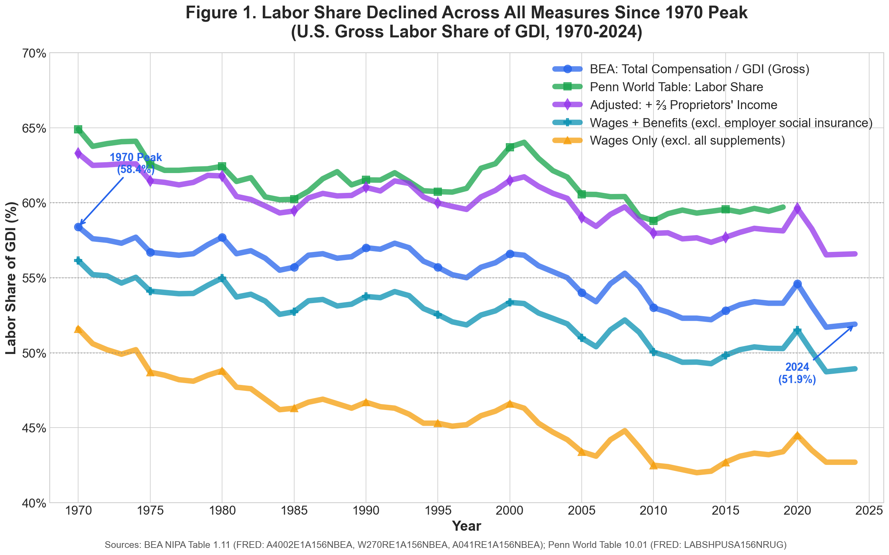
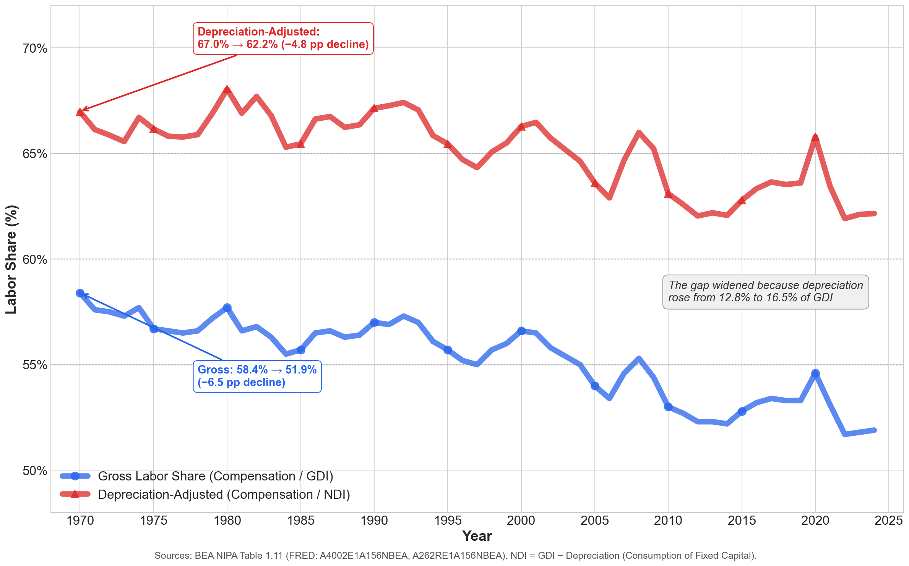
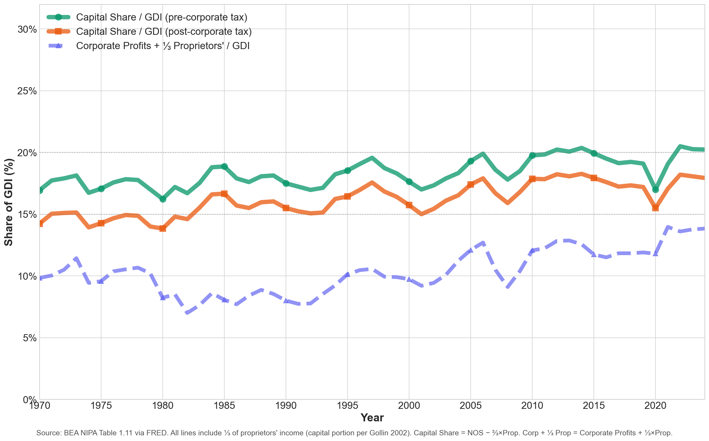

# U.S. Labor Share of GDI: A Methodological Note

## Executive Summary

**Has the U.S. labor share declined? Yes.** Under any sensible measurement approach, the current labor share is below its post-war high-water mark. The decline from the 1970 peak is real and consistent across all measures.

**What's debatable is the magnitude, not the direction.** Different measurement choices yield declines ranging from −4.8 pp to −8.9 pp — a substantial range, but all negative.

### Key Findings (1970-2024)

| Measure | 1970 | 2024 | Change |
|---------|------|------|--------|
| **Gross Labor Share** (Compensation/GDI) | 58.4% | 51.9% | **−6.5 pp** |
| **Wages + Benefits** (excl. employer FICA†) | 56.1% | 48.9% | **−7.2 pp** |
| **Wages Only** (excl. all supplements) | 51.6% | 42.7% | **−8.9 pp** |
| **Depreciation-Adjusted Labor Share** (Compensation/NDI) | 67.0% | 62.2% | **−4.8 pp** |
| Depreciation Share | 12.8% | 16.5% | +3.7 pp |
| Employer FICA† Share | 2.3% | 3.0% | +0.7 pp |

*† FICA = Federal Insurance Contributions Act (Social Security + Medicare payroll taxes). Employers pay 7.65% of wages; employees pay another 7.65%.*

**Key takeaways:**
- The **standard gross measure** shows a −6.5 pp decline
- Adjusting for rising depreciation attenuates (but does not eliminate) the decline: −4.8 pp
- Looking at **wages only** (excluding benefits and payroll taxes) shows the steepest decline: −8.9 pp

**Historical context:** The 1970 peak (58.4%) was historically high — in 1929, gross labor share was only 49.5%, below today's level. But this does not change the central finding: *labor share has declined from its peak, regardless of which measure is used.*

---

## Defining the Labor Share: Concepts and Equations

Before presenting the data, we must be precise about what we are measuring. The "labor share" is the fraction of national income that accrues to workers as compensation for their labor, as opposed to capital owners (profits, interest, rent). This section defines the key concepts rigorously.

### The Basic Definition

The **gross labor share** is defined as:

```
                    Compensation of Employees
Gross Labor Share = ─────────────────────────────
                    Gross Domestic Income (GDI)
```

This is the standard measure used in the literature ([Karabarbounis & Neiman 2014](https://www.nber.org/papers/w19136), [Autor et al. 2020](https://www.nber.org/papers/w23396), [Elsby et al. 2013](https://www.brookings.edu/articles/the-decline-of-the-u-s-labor-share/)).

### What Goes Into the Numerator?

**Compensation of Employees** (BEA series A4002E1A156NBEA) includes:

1. **Wages and Salaries**: Cash payments to workers before personal income taxes
2. **Supplements to Wages and Salaries**:
   - *Employer contributions for employee pension and insurance funds* (~6% of GDI): Health insurance, 401(k) contributions, life insurance
   - *Employer contributions for government social insurance* (~3% of GDI): The employer portion of **FICA** (Federal Insurance Contributions Act) taxes — specifically, Social Security (6.2% of wages up to a cap) and Medicare (1.45% of all wages)

This is a **pre-personal-income-tax** measure of total labor cost to employers. It does *not* include the employee's portion of FICA or personal income taxes — those are paid out of wages received.

### What Goes Into the Denominator?

**Gross Domestic Income (GDI)** is the sum of all incomes earned in production:

```
GDI = Compensation of Employees
    + Corporate Profits (with IVA and CCAdj)
    + Proprietors' Income
    + Rental Income of Persons
    + Net Interest and Miscellaneous Payments
    + Taxes on Production and Imports less Subsidies
    + Consumption of Fixed Capital (Depreciation)
```

We use GDI rather than GDP because the labor share numerator (compensation) comes from the income side of the accounts. Using GDP would mix income-side numerators with expenditure-side denominators, introducing measurement noise from the statistical discrepancy.

### The Depreciation-Adjusted (Net) Measure

A key methodological choice is whether to include depreciation in the denominator. **Depreciation** (Consumption of Fixed Capital, CFC) represents resources that must be set aside to replace worn-out capital — it is not income available for distribution to workers or capital owners.

Following [Bridgman (2018)](https://www.researchgate.net/publication/318349851_IS_LABOR'S_LOSS_CAPITAL'S_GAIN_GROSS_VERSUS_NET_LABOR_SHARES) and [Rognlie (2015)](https://www.brookings.edu/wp-content/uploads/2016/07/2015a_rognlie.pdf), we also compute a **depreciation-adjusted** labor share:

```
                               Compensation of Employees
Depreciation-Adjusted Share = ────────────────────────────────────────
                               GDI − Depreciation (= Net Domestic Income)
```

> **Terminology note:** In the labor share literature, "net" typically means *net of depreciation*, **not** net of taxes. All measures in this document are pre-income-tax.

The depreciation-adjusted measure shows a smaller decline than the gross measure because depreciation has risen substantially (from 12.8% to 16.5% of GDI). When we remove depreciation from the denominator, we are measuring labor's share of *sustainable, consumable income* rather than gross output.

### Alternative Numerator Definitions

We also examine alternative numerator definitions to isolate different components:

| Numerator | What It Measures | Interpretation |
|-----------|------------------|----------------|
| **Total Compensation** | Wages + all supplements | Total cost of employing labor |
| **Wages + Benefits (excl. FICA)** | Wages + employer pension/insurance | Excludes employer payroll taxes |
| **Wages Only** | Cash wages before taxes | Excludes all non-cash compensation |

The choice of numerator matters: wages alone have fallen more steeply than total compensation because rising employer benefits and payroll taxes have partially offset wage stagnation.

---

## Figures

### Figure 1. Labor Share Declined Across All Measures Since 1970 Peak



**What this figure shows:** Five different ways of measuring labor's share of national income, all using GDI as the denominator but varying the numerator. Each line represents a different definition of "labor income."

**Line-by-line explanation:**
- **Blue (BEA Total Compensation / GDI)**: The standard gross labor share. The numerator is total compensation of employees (wages + supplements). This is the benchmark measure used in most academic literature.
- **Teal (Wages + Benefits, excl. employer FICA)**: The numerator excludes employer payroll taxes (~3% of GDI) while keeping private benefits. This isolates the "pre-payroll-tax" labor share.
- **Green (Penn World Table)**: Uses a different methodology that imputes a labor share for self-employed workers, rather than treating proprietors' income as mixed.
- **Purple (Adjusted: + ⅔ Proprietors' Income)**: Adds two-thirds of proprietors' income to the numerator, following [Gollin (2002)](https://www.journals.uchicago.edu/doi/abs/10.1086/340770), to account for the labor component of self-employment income.
- **Amber (Wages Only)**: The numerator is just wages and salaries — no benefits, no employer payroll taxes. This shows the steepest decline.

**Interpretation:** All five measures show a decline from 1970 to 2024. The magnitude varies: the decline is −6.5 pp for the standard measure, but −8.9 pp for wages only. This means that rising employer contributions to benefits and payroll taxes have partially masked wage stagnation. If you care about workers' cash wages, the decline is steeper than the headline labor share suggests.

### Figure 2. Depreciation-Adjusted Labor Share Also Declined, But Less Steeply



**What this figure shows:** The same numerator (total employee compensation) divided by two different denominators: GDI (gross) vs NDI (net of depreciation).

**Line-by-line explanation:**
- **Blue (Gross Labor Share = Compensation / GDI)**: The standard measure. The denominator includes depreciation (Consumption of Fixed Capital).
- **Red (Depreciation-Adjusted = Compensation / NDI)**: The denominator is Net Domestic Income = GDI − Depreciation. This removes resources set aside to replace worn-out capital.

**Why the gap between the lines widened:** In 1970, depreciation was 12.8% of GDI; by 2024, it had risen to 16.5%. When we subtract depreciation from the denominator, we get a smaller number (NDI), which mechanically increases the labor share ratio. As depreciation grew, this effect strengthened, widening the gap between the two lines.

**A common confusion: "Depreciation is a capital cost, so why does removing it affect labor share?"**

This is counterintuitive. Depreciation is indeed a cost attributable to capital — it represents wear and tear on machinery, software, and buildings. You might expect that removing depreciation would only affect the *capital* share, not the labor share.

But here's the key: depreciation affects the **denominator** of the labor share ratio, not the numerator. Consider:
- Gross labor share = Compensation / GDI
- Depreciation-adjusted labor share = Compensation / (GDI − Depreciation)

When we remove depreciation from the denominator, we make the denominator *smaller*. Dividing by a smaller number produces a *larger* result. So the depreciation-adjusted labor share is always higher than the gross labor share.

As depreciation rose from 12.8% to 16.5% of GDI, the difference between GDI and NDI grew. This made the depreciation-adjusted labor share rise *relative to* the gross labor share — even though both declined in absolute terms.

**Interpretation:** The depreciation-adjusted measure shows a smaller decline (−4.8 pp vs −6.5 pp for gross). This matters because depreciation is not income available for consumption — it represents capital maintenance costs. If you want to know labor's share of *sustainable, distributable income*, the depreciation-adjusted measure is more appropriate. But the decline is real under both measures.

> **Terminology note:** In the labor share literature, "net" means *net of depreciation* (using NDI as denominator), **not** net of taxes. All measures in this document are pre-income-tax.

### Figure 3. Capital Share Rose as Labor Share Fell



**What this figure shows:** The share of national income going to capital owners, computed as a residual after subtracting labor compensation, depreciation, and taxes on production from GDI. This is the "Net Operating Surplus" — the income available for corporate profits, interest, rent, and the capital portion of proprietors' income.

**The equation:**
```
Net Operating Surplus = GDI − Compensation − Depreciation − Taxes on Production
```

**Line-by-line explanation:**
- **Green (NOS / GDI, pre-corporate tax)**: Net Operating Surplus as a share of GDI, before corporate income taxes are paid. This rose from 21.8% (1970) to 24.9% (2024), a +3.1 pp increase.
- **Teal (NOS / GDI, post-corporate tax)**: After subtracting taxes on corporate income. Still shows an increase, though smaller.
- **Dashed indigo (Corporate Profits only)**: Just the corporate profits component (with IVA and CCAdj), excluding proprietors' income, interest, and rent. Corporate profits rose substantially, from 7.4% to 11.5% of GDI.

**Interpretation:** As labor's share of GDI fell by 6.5 percentage points, capital's share (Net Operating Surplus) rose by about 3 percentage points. The remainder was absorbed by rising depreciation (+3.7 pp). In other words:
- **Labor share**: −6.5 pp
- **Capital share (NOS)**: +3.1 pp
- **Depreciation share**: +3.7 pp
- **Taxes on production**: ~0 pp

These changes approximately sum to zero (allowing for rounding), as they must — the shares of GDI must sum to 100%.

**Corporate profits drove the capital share increase.** Within the Net Operating Surplus, corporate profits rose most dramatically — from 7.4% to 11.5% of GDI (+4.1 pp). This reflects increased profit margins, market concentration, and the rise of high-margin technology firms.

> **Important caveat:** The NOS measure in this figure includes *all* of proprietors' income (~7% of GDI). However, the Gollin (2002) adjustment used in Figure 1 allocates ⅔ of proprietors' income to *labor*. If we applied that same adjustment here, the "Gollin-adjusted capital share" would be:
>
> `NOS − (⅔ × Proprietors' Income) = 24.9% − (0.67 × 7.0%) = 20.2% (2024)`
>
> This would show a smaller increase in capital share (+1.4 pp instead of +3.1 pp). The figure above uses the simpler NOS definition for transparency, but readers should note this limitation when comparing to Gollin-adjusted labor share measures.

---

## Methodological Notes

### Why GDI, Not GDP? (Denominator Choice)

The labor share is a ratio. The **denominator** is the measure of total national income. We use **GDI** (Gross Domestic Income), not GDP, as the denominator. Here's why:

1. **The numerator comes from the income side.** Compensation of employees is a component of GDI (the income-side measure). Using GDI as the denominator means both numerator and denominator come from the same accounting framework.

2. **Using GDP as denominator introduces noise.** GDP (expenditure-side) and GDI (income-side) differ by a "statistical discrepancy" (typically ~1% of GDP). Dividing an income-side numerator by an expenditure-side denominator mixes measurement error into the ratio.

3. **The shares sum correctly with GDI.** When we use GDI as the denominator, the component shares (compensation, profits, depreciation, etc.) sum to exactly 100%. This would not hold if we used GDP.

### Tax Boundary Declaration

All factor shares in this note are measured **before income taxes**:

| Component | Tax Treatment | Reference |
|-----------|---------------|-----------|
| **Compensation** | Pre-personal income tax, pre-employee FICA; *includes* employer FICA | Standard total labor cost |
| **Corporate Profits** (with IVA+CCAdj) | Pre-corporate income tax | [BEA definition](https://www.bea.gov/help/glossary/corporate-profits-iva-and-ccadj) |
| **Proprietors' Income** | Pre-personal income tax | Mixed labor/capital |
| **Taxes on Production** | Sales taxes, property taxes, excises | *Not* income taxes |

**What "pre-tax" and "post-tax" mean here:**
- **Pre-personal income tax**: Wages are measured before workers pay income taxes
- **Pre-corporate income tax**: Profits are measured before firms pay corporate taxes
- **Employer FICA**: Included in compensation (standard practice); can be separated out

**We do not construct an "after personal income taxes" labor share** in this note. Doing so requires tax-incidence assumptions (who bears the burden of each tax?) that are beyond the scope of this analysis.

### What "Employee Compensation" Includes (Numerator Components)

The BEA "Compensation of Employees" series (A4002E1A156NBEA) includes:

| Component | 2024 Share | Description |
|-----------|------------|-------------|
| **Wages and Salaries** | 42.7% | Cash payments to workers (pre-income tax) |
| **Supplements** | 9.2% | Benefits + employer social insurance contributions |
| └ Employer pension/insurance | ~6.2% | Health insurance, 401(k) contributions |
| └ Employer social insurance (FICA) | ~3.0% | Employer portion of Social Security + Medicare |

**Tax treatment in labor share measures:**

| Tax Type | Treatment in Compensation | Notes |
|----------|---------------------------|-------|
| **Personal income tax** | Pre-tax | Workers pay this out of wages received |
| **Employee FICA** (~7.65%) | Pre-tax | Workers pay this out of wages received |
| **Employer FICA** (~7.65%) | Included in supplements | Standard practice (total labor cost) |

**Why include employer FICA?** This is standard in the literature ([Karabarbounis & Neiman 2014](https://www.nber.org/papers/w19136), [Autor et al. 2020](https://www.nber.org/papers/w23396)) because:
1. It represents the **total cost of employing labor**
2. It funds benefits workers receive (Social Security, Medicare)
3. Excluding it would understate the true labor share

**Alternative measures for different questions:**

| If you want... | Use this measure | 1970→2024 |
|----------------|------------------|-----------|
| Total labor cost to firms | Total Compensation | −6.5 pp |
| Labor share ex-payroll taxes | Wages + Benefits (excl. FICA) | −7.2 pp |
| Cash wages only | Wages Only | −8.9 pp |

The **"Wages + Benefits (excl. FICA)"** line (teal in Figure 1) excludes employer payroll taxes while keeping private benefits. This shows that excluding payroll taxes, the labor share decline is *steeper* (−7.2 pp), not smaller—because employer FICA rose from 2.3% to 3.0% of GDI.

### Gross vs Depreciation-Adjusted Labor Share

**Gross Labor Share** = Compensation / GDI

**Depreciation-Adjusted Labor Share** = Compensation / NDI = Compensation / (GDI − Depreciation)

> **Important:** "Net" or "depreciation-adjusted" here means *net of depreciation*, **not** net of taxes. This is standard terminology in the labor share literature but can confuse readers.

The depreciation-adjusted measure matters because depreciation (Consumption of Fixed Capital) is **not income available for consumption** — it represents the resources needed to replace worn-out capital. Following [Bridgman (2018)](https://www.researchgate.net/publication/318349851_IS_LABOR'S_LOSS_CAPITAL'S_GAIN_GROSS_VERSUS_NET_LABOR_SHARES) and [Rognlie (2015)](https://www.brookings.edu/wp-content/uploads/2016/07/2015a_rognlie.pdf), the depreciation-adjusted labor share is more relevant for understanding the distribution of *sustainable* income.

**Why depreciation rose:**
- Shift from long-lived assets (buildings: 2-3%/year depreciation) to short-lived assets (software: 25-33%/year)
- Rise of intellectual property products (R&D, software, entertainment originals)
- More capital-intensive economy overall

### Capital Share Methodology: Interest, Rent, and the NIPA Identity

A concern raised: *How do we ensure interest income and rent aren't double-counted when calculating capital's share?*

#### The Key Principle: Profits Are "After Costs"

Corporate profits in the NIPAs (with IVA and CCAdj) are measured as receipts less expenses—including wages, interest paid, and rent paid. This is a *pre-corporate-income-tax* concept. ([BEA Glossary](https://www.bea.gov/help/glossary/corporate-profits-iva-and-ccadj))

#### The "Net Interest" Trap: It's NOT "Bank's Income"

**Caution:** The "Net Interest and Miscellaneous Payments" line in GDI is **not** a direct measure of financial sector income. It is an *identity offset* constructed to make the production-income identity balance. ([BEA NIPA Handbook Ch. 14](https://www.bea.gov/resources/methodologies/nipa-handbook/pdf/chapter-14.pdf))

Specifically:
- Corporate profits *include* net receipts of interest (interest received minus interest paid)
- The "Net Interest" GDI component then *offsets* this by showing economy-wide net interest payments
- This is an accounting convention, not a clean attribution of income to lenders

**Do not interpret "Net Interest" as "the bank's income."** It's a balancing item in the national accounts identity.

#### How GDI Components Are Defined

| Component | What It Measures | Treatment of Interest/Rent |
|-----------|------------------|----------------------------|
| **Corporate Profits** (with IVA+CCAdj) | Profits from current production, *pre-corporate income tax* | Net of interest paid, rent paid, wages, depreciation |
| **Net Interest** | Economy-wide net interest payments (an identity offset) | **Not** = financial sector income |
| **Rental Income** | Income of persons from property ownership | Direct measure of landlord income |
| **Compensation** | Wages + supplements paid to employees | — |
| **Proprietors' Income** | Mixed labor/capital income of self-employed | — |
| **Depreciation (CFC)** | Consumption of fixed capital | Not "income" to anyone |
| **Taxes on Production** | Sales taxes, property taxes, excises, etc. | Distinct from income taxes |

#### Why Components Sum to 100%

The BEA separates depreciation as its own GDI component rather than embedding it in profits. All components are mutually exclusive by construction:

Compensation + Profits + Proprietors' + Rental + Net Interest + Depreciation + Taxes on Production = GDI (100%)

#### Capital Share Calculation (If Needed)

For capital's share, the cleanest approach is the **residual method**:

```
Capital Share = (GDI − Compensation − Taxes on Production − labor portion of Proprietors') / GDI
```

This avoids the "net interest" interpretation problem entirely.

For **depreciation-adjusted** capital share (using NDI):
```
Depreciation-Adjusted Capital Share = (NDI − Compensation − Taxes − labor portion of Proprietors') / NDI
```

> **Recommendation:** If you're focused on "capital vs labor," use **Net Operating Surplus** as your capital aggregate (which BEA publishes), rather than manually summing profits + interest + rent. This sidesteps the net-interest accounting complexity.

---

## Sector Scope: Whole Economy vs Business Sector

This analysis uses **whole-economy GDI shares**, which include:
- Government sector (employees paid by government)
- Housing sector (imputed rent from owner-occupied housing)
- All industries and legal forms

**Why this matters:**
- **Government tends to raise measured labor share** — government has little measured operating surplus
- **Owner-occupied housing can lower labor share** — adds imputed rental income with no compensation

The **nonfarm business sector** shows a clearer decline. The [BLS nonfarm business labor share index](https://fred.stlouisfed.org/series/PRS85006173) is down ~16% from its early-1970s high (index: ~115 in 1970 vs 96.9 in 2024Q4).

---

## Key Findings Explained

### 1. Gross labor share declined ~6.5 pp from 1970 peak

Labor share peaked at 58.4% in 1970 and fell to 51.9% by 2024. This timing coincides with declining unionization, globalization, and automation — though causal attribution requires careful analysis.

### 2. Depreciation-adjusted labor share declined less (~4.8 pp)

When adjusting for rising depreciation, the decline is attenuated. The depreciation-adjusted labor share went from 67.0% (1970) to 62.2% (2024) — a decline of 4.8 pp compared to 6.5 pp for gross. The depreciation-adjusted decline is ~26% smaller than the gross decline.

### 3. Decomposing the labor share decline

The three-way decomposition reveals where the "missing" labor share went:

| Measure (Numerator / GDI) | 1970 | 2024 | Change |
|---------------------------|------|------|--------|
| Total Compensation (wages + all supplements) | 58.4% | 51.9% | −6.5 pp |
| Wages + Benefits (excl. employer FICA) | 56.1% | 48.9% | −7.2 pp |
| Wages Only (cash wages, no supplements) | 51.6% | 42.7% | −8.9 pp |

**Key insight:** The rise in supplements (+2.4 pp) consists of:
- **Private benefits** (pension, health insurance): ~+1.7 pp
- **Employer FICA** (Social Security, Medicare): ~+0.7 pp

If you view employer FICA as a "tax on labor" rather than compensation *to* labor, the true labor share decline is steeper (−7.2 pp).

**Caveat:** Rising private benefits doesn't necessarily mean workers are better off — much of it reflects healthcare cost inflation, not improved coverage.

### 4. Historical context: 1929 was lower

The 1929 gross labor share was 49.5% — below the current 2024 level (51.9%). The 1970 peak was historically high, driven partly by:
- Strong unions
- Tight labor markets
- Less international competition
- Lower capital intensity

---

## Data Tables

### BEA GDI Component Shares (1970 vs 2024)

| Component | 1970 | 2024 | Δ |
|-----------|------|------|---|
| **Compensation of Employees** | **58.4%** | **51.9%** | **−6.5 pp** |
| └ Wages & Salaries | 51.6% | 42.7% | −8.9 pp |
| └ Wages + Benefits (excl. employer FICA)† | 56.1% | 48.9% | −7.2 pp |
| └ Supplements (total) | 6.8% | 9.2% | +2.4 pp |
|   └ Employer pension/insurance | ~4.5% | ~6.2% | ~+1.7 pp |
|   └ Employer FICA (Social Security, Medicare) | ~2.3% | ~3.0% | ~+0.7 pp |
| Proprietors' Income | 7.3% | 7.0% | −0.3 pp |
| Corporate Profits (with IVA+CCAdj)‡ | 7.4% | 11.5% | +4.1 pp |
| Rental Income | ~2% | 3.7% | ~+2 pp |
| Net Interest | ~4% | 2.1% | ~−2 pp |
| **Depreciation (CFC)** | **12.8%** | **16.5%** | **+3.7 pp** |
| Taxes on Production§ | ~7% | 6.7% | ~0 pp |

*Sources: BEA NIPA Table 1.11 via FRED. Key series: [Compensation (A4002E1A156NBEA)](https://fred.stlouisfed.org/series/A4002E1A156NBEA), [Wages (W270RE1A156NBEA)](https://fred.stlouisfed.org/series/W270RE1A156NBEA), [Depreciation (A262RE1A156NBEA)](https://fred.stlouisfed.org/series/A262RE1A156NBEA), [Corporate Profits (A445RE1A156NBEA)](https://fred.stlouisfed.org/series/A445RE1A156NBEA). 1970 subcomponent values are approximate. Note: Component shares may not sum to exactly 100% due to rounding in source data (BEA publishes shares rounded to one decimal place).*

**Table notes:**
- † **Wages + Benefits (excl. employer FICA)**: Compensation minus employer FICA. This "pre-payroll-tax" measure shows a steeper decline (−7.2 pp) than total compensation (−6.5 pp).
- ‡ **Corporate Profits**: Reported *net of* interest paid, rent paid, and depreciation, but *before* corporate income taxes. Corporate income taxes are paid out of this figure. ([BEA definition](https://www.bea.gov/help/glossary/corporate-profits-iva-and-ccadj))
- § **Taxes on Production**: Includes sales taxes, property taxes, customs duties, etc. These are distinct from corporate income taxes (which come out of profits) and personal income taxes (which workers pay out of compensation).

**Optional extension (not shown):** For a *post-corporate-tax* profit measure, use "Corporate profits after tax with IVA and CCAdj" = profits before tax − taxes on corporate income. ([BEA NIPA Handbook Ch. 13](https://www.bea.gov/resources/methodologies/nipa-handbook/pdf/chapter-13.pdf))

### Historical Reference: 1929

| Measure | 1929 | 2024 | Note |
|---------|------|------|------|
| Gross Labor Share | 49.5% | 51.9% | 2024 is *higher* |
| Depreciation-Adjusted Labor Share | 55.0% | 62.2% | 2024 is *much higher* |
| Depreciation | 10.0% | 16.5% | Rose substantially |
| Proprietors' Income | 13.5% | 7.0% | Collapsed (structural shift) |

---

## Which Measure Should You Use?

| Your Question | Recommended Measure | Why |
|---------------|---------------------|-----|
| **Are corporations squeezing workers?** | Gross (corporate sector) | Shows actual firm-level revenue split |
| **What income is sustainable?** | Depreciation-adjusted (Comp/NDI) | Depreciation isn't available for consumption |
| **How do wages compare to total labor costs?** | Wages vs Total Compensation | Reveals role of benefits/payroll taxes |
| **What's the "pre-payroll-tax" labor share?** | Wages + Benefits (excl. FICA) | Excludes employer FICA from numerator |
| **International comparisons** | Penn World Table | Standardized methodology |
| **Short-run dynamics** | BLS Nonfarm Business | Quarterly frequency |

---

## Literature

### Key Papers

| Paper | Key Argument |
|-------|--------------|
| [**Bridgman (2018)**](https://www.researchgate.net/publication/318349851_IS_LABOR'S_LOSS_CAPITAL'S_GAIN_GROSS_VERSUS_NET_LABOR_SHARES) | Net labor share is more relevant; shows less decline than gross |
| [**Rognlie (2015)**](https://www.brookings.edu/wp-content/uploads/2016/07/2015a_rognlie.pdf) | Most of capital share increase is housing; net capital share stable |
| [**Karabarbounis & Neiman (2014)**](https://www.nber.org/papers/w19136) | Global labor share declined; driven by falling investment prices |
| [**Autor et al. (2020)**](https://www.nber.org/papers/w23396) | "Superstar firms" with low labor shares capture market share |
| [**Koh et al. (2020)**](https://onlinelibrary.wiley.com/doi/abs/10.3982/ECTA17477) | IPP capitalization explains entire decline |

---

## Data Sources

| Source | Series ID | Description |
|--------|-----------|-------------|
| BEA NIPA | [A4002E1A156NBEA](https://fred.stlouisfed.org/series/A4002E1A156NBEA) | Compensation share of GDI |
| BEA NIPA | [W270RE1A156NBEA](https://fred.stlouisfed.org/series/W270RE1A156NBEA) | Wages & salaries share of GDI |
| BEA NIPA | [A262RE1A156NBEA](https://fred.stlouisfed.org/series/A262RE1A156NBEA) | Depreciation share of GDI |
| BEA NIPA | [A041RE1A156NBEA](https://fred.stlouisfed.org/series/A041RE1A156NBEA) | Proprietors' income share of GDI |
| BEA NIPA | [A445RE1A156NBEA](https://fred.stlouisfed.org/series/A445RE1A156NBEA) | Corporate profits (pre-tax) share of GDI |
| BEA NIPA | [W273RE1A156NBEA](https://fred.stlouisfed.org/series/W273RE1A156NBEA) | Corporate profits (post-tax) share of GDI |
| Penn World Table | [LABSHPUSA156NRUG](https://fred.stlouisfed.org/series/LABSHPUSA156NRUG) | Labor share (different methodology) |
| BLS | [PRS85006173](https://fred.stlouisfed.org/series/PRS85006173) | Nonfarm business labor share index |

All data accessed via [FRED](https://fred.stlouisfed.org/) (Federal Reserve Economic Data).

---

## Replication

### Running the Code

```bash
python3 generate_chart.py
```

This produces:
- `labor_share_gross.png/pdf` — Main chart with multiple measures
- `labor_share_net_vs_gross.png/pdf` — Depreciation effect chart
- `labor_share_comparison.png/pdf` — Combined overview

### Calculations

**Depreciation-Adjusted Labor Share:**
```
NDI = GDI × (1 - Depreciation_Share)
Depreciation_Adjusted_Labor_Share = Compensation_Share / (1 - Depreciation_Share)

Example (2024):
NDI = 100% × (1 - 0.165) = 83.5%
Depreciation_Adjusted_Labor_Share = 51.9% / 83.5% = 62.2%
```

Note: "Net" in labor share literature means net-of-depreciation, NOT net-of-taxes.

**Adjusted Labor Share (with proprietors' income):**
```
Adjusted = Compensation_Share + (α × Proprietors_Share)
where α = 0.67 (following Gollin 2002)

Example (2024):
Adjusted = 51.9% + (0.67 × 7.0%) = 56.6%
```

---

## License

This research note is shared for educational and research purposes. Data sources are public domain (BEA, BLS) or citation-requested (Penn World Table).

---

## Author

Research note compiled by [Claude Code](https://claude.ai/code) under the direction of **Ilan Strauss**.

January 2026

---

## Changelog

- **v2.2** (January 2026): Major methodological fixes: (1) Renamed "Net Labor Share" → "Depreciation-adjusted labor share" to avoid confusion with "after-tax"; (2) Corrected net interest explanation (it's an identity offset, NOT "bank's income"); (3) Added explicit tax boundary declaration; (4) Added BEA NIPA Handbook citations
- **v2.1** (January 2026): Added "Wages + Benefits (excl. FICA)" measure; clarified tax treatment (corporate profits are pre-corporate income tax); added explicit note that GDI components sum to 100%; expanded supplements decomposition in data tables
- **v2.0** (January 2026): Refocused on 1970-2024 period; added separate gross/net charts; improved axis readability (5-year intervals); added wages-only measure; expanded methodology notes on pre-tax treatment and capital share calculation
- **v1.1** (January 2026): Added section on IT, software, and superstar firms
- **v1.0** (January 2026): Initial research note
