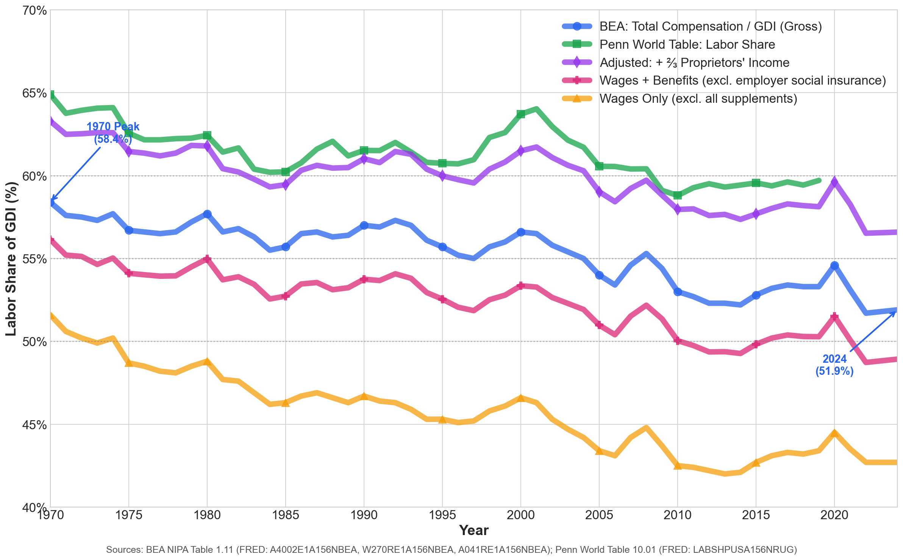
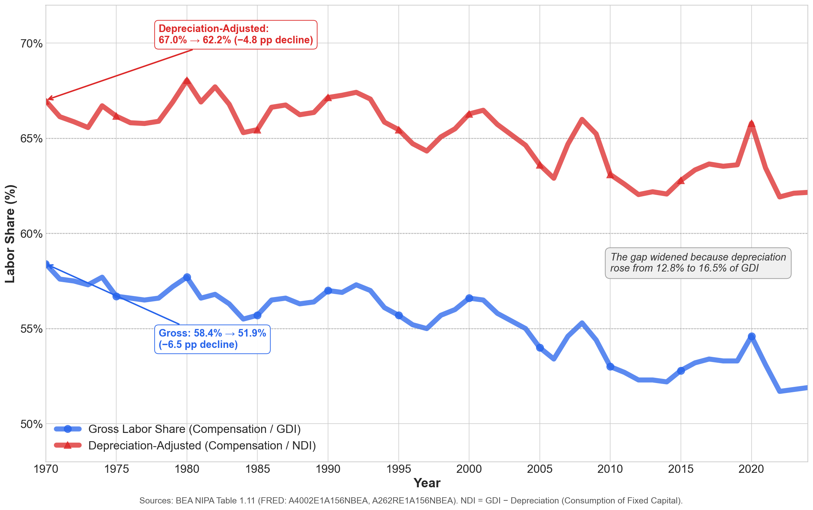
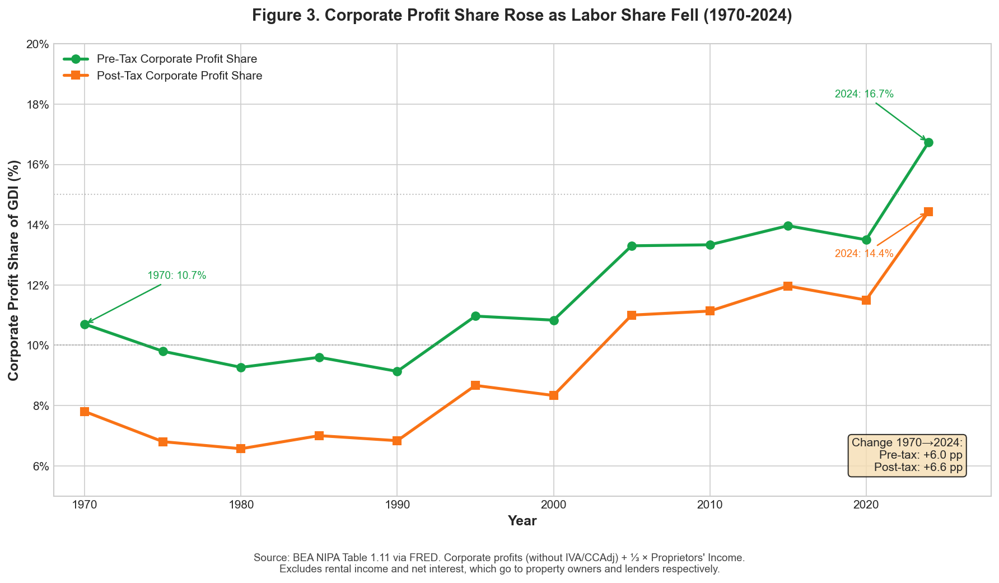

# Has the U.S. Labour Share Declined? A note (v.2)

## Executive Summary

**U.S. labor share declines while profit share grows** Yes! Across the standard BEA whole-economy measures in Table 1.11, the labor share is well below its late-1960s/1970 peak. The decline is consistent across all measures examined here, though magnitude varies with methodological choices. Concurrent to this has been a dramatic rise in the profit share of the income (which excludes interest income and rental income). 

**The rise of profits and depreciation.** It should be noted that the profit share of income remains only 16.7% post tax and is roughly equal now to the depreciation share of income. Depreciation is income set aside by the firm to replace the value of its fixed capital as it declines in productivity. 

**So who is benefiting from the decline in the labor share?** Depreciation income does not really represent income available to the firm as profits. As such the profit share measure deducts depreciation. It also means as the economy's production becomes more machine-intensive, the depreciation share of income will continue to rise, especially as the life of its assets decline. Depreciation, therefore, arguably represents a share of income that does not benefit anyone per se. However, if the price of capital goods falls sharply (as with computing hardware) then depreciation may not grow in value terms even as machinery become more important to production.

### Key Findings (1970-2024)

| Measure | 1970 | 2024 | Change (pp) | Change (%) |
|---------|------|------|-------------|------------|
| **Labor Share** (Compensation/GDI) | 58.4% | 51.9% | **−6.5 pp** | **−11%** |
| **Corporate Profit Share, Pre-Tax** | 10.7% | 16.7% | **+6.0 pp** | **+56%** |
| **Corporate Profit Share, Post-Tax** | 7.8% | 14.4% | **+6.6 pp** | **+85%** |
| **Depreciation** | 12.8% | 16.5% | **+3.7 pp** | **+29%** |

**Definitions:**
- **Labor Share** = Compensation of Employees / Gross Domestic Income. Compensation includes wages, salaries, and employer-paid benefits (health insurance, pensions, payroll taxes).
- **Corporate Profit Share** = (Corporate Profits + ⅓ × Proprietors' Income) / GDI. Corporate profits as reported by BEA are **already net of depreciation** — depreciation is deducted as a cost at the firm level before profits are reported. We add ⅓ of proprietors' income to account for the capital return portion of self-employment income, per [Gollin (2002)](https://web.williams.edu/Economics/wp/Gollin_Getting_Income_Shares_Right_working_paper_with_figures.pdf). Pre-tax uses profits before corporate income tax; post-tax subtracts corporate taxes. Both **exclude** rental income (3.7% of GDI) and net interest (2.1%), which go to property owners and lenders respectively.
- **Depreciation** = Consumption of Fixed Capital / GDI. This is an accounting allowance for capital wearing out — not income to anyone. As the economy shifted toward short-lived assets (software depreciates at 25–33%/year vs. 2–3% for buildings), depreciation's share rose.

*Source: BEA NIPA [Table 1.11 via FRED](https://fred.stlouisfed.org/release/tables?rid=53&eid=42211).*

**Key takeaway:** As labor's share fell by 6.5 pp, corporate profits (post-tax) rose by 6.6 pp. Depreciation absorbed an additional 3.7 pp — representing capital maintenance costs that are not income to anyone.

**Sector scope:** This analysis uses **whole-economy GDI shares**. The [BLS nonfarm business sector](https://fred.stlouisfed.org/series/PRS85006173) — which excludes government and housing — shows an even steeper labor share decline (~16% from its early-1970s peak).

---

## Defining the Labor Share

The "labor share" is the fraction of national income that accrues to workers as compensation for their labor, as opposed to capital owners (profits, interest, rent). This section defines the key concepts.

### The Basic Definition

The **gross labor share** is defined as:

```
                    Compensation of Employees
Gross Labor Share = ─────────────────────────────
                    Gross Domestic Income (GDI)
```

This is the standard measure used in the literature ([Karabarbounis & Neiman 2014](https://www.nber.org/papers/w19136), [Autor et al. 2020](https://www.nber.org/papers/w23396), [Elsby et al. 2013](https://www.brookings.edu/articles/the-decline-of-the-u-s-labor-share/)).

### What Goes Into the Numerator?

**Compensation of Employees** (BEA series A4002E1A156NBEA) includes:

1. **Wages and Salaries**: Cash payments to workers before personal income taxes
2. **Supplements to Wages and Salaries**:
   - *Employer contributions for employee pension and insurance funds* (~6% of GDI): Health insurance, 401(k) contributions, life insurance
   - *Employer contributions for government social insurance* (~3% of GDI): Dominated by Social Security and Medicare payroll contributions (FICA, ~7.65% of wages), plus other government social insurance programs (unemployment insurance, workers' compensation, etc.)

This is a **pre-personal-income-tax** measure of total labor cost to employers. It does *not* include the employee's portion of FICA or personal income taxes — those are paid out of wages received.

### What Goes Into the Denominator?

**Gross Domestic Income (GDI)** is the sum of all incomes earned in production. At the **Table 1.11 level**, the identity is:

```
GDI = Compensation of Employees
    + Net Operating Surplus (NOS)
    + Taxes on Production and Imports less Subsidies
    + Consumption of Fixed Capital (Depreciation)
```

Where **Net Operating Surplus** is itself composed of:
- Corporate Profits (with IVA and CCAdj)
- Proprietors' Income
- Rental Income of Persons
- Net Interest and Miscellaneous Payments

This structure matters: the four NOS subcomponents are not independent. In particular, "Net Interest" is an offset item (see below), not a standalone income measure.

We use GDI rather than GDP because the labor share numerator (compensation) comes from the income side of the accounts. Using GDP would mix income-side numerators with expenditure-side denominators, introducing measurement noise from the statistical discrepancy.

### Note on Gross vs. Net Measures

**Our primary findings use Gross Domestic Income (GDI) as the denominator**, which is the standard in the literature. An alternative approach uses Net Domestic Income (NDI = GDI − Depreciation), which excludes capital maintenance costs.

From a distributional standpoint, NDI is arguably more relevant for understanding "who benefits" since depreciation is not income available to anyone — it represents resources set aside to replace worn-out capital. However, gross measures are more directly comparable across studies and represent total economic output.

Figure 2 compares both measures. See **Appendix A** for full NDI methodology.

### Alternative Numerator Definitions

We also examine alternative numerator definitions to isolate different components:

| Numerator | What It Measures | Interpretation |
|-----------|------------------|----------------|
| **Total Compensation** | Wages + all supplements | Total cost of employing labor |
| **Wages + Benefits (excl. employer social insurance)** | Wages + employer pension/insurance | Excludes employer payroll taxes |
| **Wages Only** | Cash wages before taxes | Excludes all non-cash compensation |

The choice of numerator matters: wages alone have fallen more steeply than total compensation because rising employer benefits and payroll taxes have partially offset wage stagnation.

---

## Figures

### Figure 1. Labor Share Declined Across All Measures Since 1970 Peak



Figure 1 shows five different ways of measuring labor's share of national income, all using GDI as the denominator but varying the labor income numerator (the top of the equation). Each line represents a different definition of "labor income."

- **BEA Total Compensation**: Blue line. The standard gross labor share. The numerator is total compensation of employees (wages + supplements). This is the benchmark measure used in most academic literature.

- **Wages + Benefits (excl. employer social insurance)**: Pink line. The numerator excludes employer contributions for government social insurance (~3% of GDI, dominated by FICA) while keeping private benefits.

- **Penn World Table (1970–2019 only)**: Green lines. Uses a different methodology that imputes a labor share for self-employed workers, rather than treating proprietors' income as mixed. *Note: PWT data ends in 2019; the line does not extend to 2024.*

- **Adjusted: Includes ⅔ Proprietors' Income**: Purple line. Adds two-thirds of proprietors' income to the numerator, following [Gollin (2002)](https://web.williams.edu/Economics/wp/Gollin_Getting_Income_Shares_Right_working_paper_with_figures.pdf), to account for the labor component of self-employment income.

- **Wages Only**: Amber line. The numerator is just wages and salaries — no benefits, no employer payroll taxes. This shows the steepest decline.

**Interpretation:** All measures show a decline from 1970 to the latest available year (BEA series through 2024; Penn World Table through 2019). The magnitude varies: the decline is −6.5 pp for the standard measure, but −8.9 pp for wages only. This means that rising employer contributions to benefits and payroll taxes have partially masked wage stagnation. If you care about workers' cash wages, the decline is steeper than the headline labor share suggests.

Next, we move on to the importance of adjusting total income for depreciation. 

**Terminology note:** In the labor share literature, "net" means *net of depreciation* (using NDI as denominator), **not** net of taxes. All measures in this document are pre-income-tax.

### Figure 2. Labor Share of Net Income (NDI) Also Declined, But Less Steeply



**Our primary measure uses GDI (blue line).** The NDI measure (red line) is shown for comparison, as it better reflects distributable income.

Figure 2 shows the same total employee compensation (numerator) but divided by two different denominators: one is gross (GDI) the other is net (NDI), meaning depreciation of fixed capital has been deducted. 

Depreciation is a capital maintenance cost — it represents wear and tear on machinery, software, and buildings. Depreciation is not income available for consumption — it represents capital maintenance costs. If you want to know labor's share of *sustainable, distributable income*, the NDI measure is more appropriate. But the decline is real under both measures. The NDI-basis measure shows a smaller decline though (−4.8 pp vs −6.5 pp for gross). 

The standard measure of total income does not exclude depreciation (Blue line) - hence GDI. This contrasts with the red line (net domestic income), whereby depreciation is removed as income from the economy leading to the labour share of income increasing as it is divided by a smaller amount. It is a mechanical relationship. Labor's higher net-income share is the residual result. The gap between two lines has widened. In 1970, depreciation was 12.8% of GDI; by 2024, it had risen to 16.5%. As the depreciation share grew, the difference between GDI and NDI widened. This made labor's share of NDI rise *relative to* the gross labor share — even though both declined in absolute terms.


Next, Figure 3 shows the corporate profit share of GDI — the share going to shareholders, excluding rental income (which goes to property owners) and net interest (which goes to lenders).

### Figure 3. Corporate Profit Share Rose as Labor Share Fell



Both lines show **corporate profits** (excluding rent and interest) plus **⅓ of proprietors' income** (the capital portion per Gollin 2002), making them consistent with the Gollin-adjusted labor share in Figure 1.

**The equation:**
```
Corporate Profit Share = Corporate Profits + (⅓ × Proprietors' Income)
```

*Note: Both measures exclude rental income (3.7% of GDI in 2024) and net interest (2.1%), which are separate GDI components going to property owners and lenders respectively.*

- **Pre-Tax Corporate Profit Share (Green)**: Corporate profits before tax plus ⅓ of proprietors' income. This rose from 10.7% (1970) to 16.7% (2024), a **+6.0 pp** increase.

- **Post-Tax Corporate Profit Share (Orange)**: As above, but subtracting taxes on corporate income. This rose from 7.8% (1970) to 14.4% (2024), a **+6.6 pp** increase.

**Key Point:** As labor's share of GDI fell by 6.5 percentage points, corporate profits (post-tax) rose by 6.6 pp. The remainder was absorbed by rising depreciation (+3.7 pp).

**Perspective on size:** While corporate profits rose substantially in percentage point terms, the post-tax corporate profit share (excluding rent and interest) remains modest at 14.4% of GDI. Labor compensation (51.9%) still dominates. And if we further adjust for depreciation — calculating corporate profits as a share of *Net* Domestic Income — the capital income share is even smaller, since depreciation (16.5% of GDI) is subtracted from the denominator.

---

For detailed methodological notes, data tables, replication code, and technical appendices, see **[METHODOLOGY.md](METHODOLOGY.md)**.

---

## Appendix A: The Net Domestic Income (NDI) Measure

A key methodological choice is whether to measure factor shares over **gross** or **net** income. **Depreciation** (Consumption of Fixed Capital, CFC) represents resources that must be set aside to replace worn-out capital — it is not income available for distribution to workers or capital owners.

**The distributional logic (capital-first):**

Depreciation is a **capital maintenance cost**. Moving from **gross** to **net** income subtracts depreciation from the denominator (total domestic income) **before** dividing the income between labor and capital. This automatically raises the labor share (dividing labor income by a smaller number). Therefore:

1. Depreciation **reduces** capital's net income and in turn the net capital income share
2. Labor's *higher* share of net income is then the residual consequence of the now smaller net-income pie

The accounting identities make this explicit:

```
Gross income identity (Table 1.11):
  GDI = Compensation + Net Operating Surplus + Taxes on Production + Depreciation

Net income identity (distribution-relevant):
  NDI = GDI − Depreciation = Compensation + Net Operating Surplus + Taxes on Production
```

On a net basis, depreciation has already been netted out of capital's claim; labor's higher share is the corollary of measuring the split over net income.

Following [Bridgman (2018)](https://bea.gov/papers/pdf/laborshare1410.pdf) and [Rognlie (2015)](https://www.brookings.edu/wp-content/uploads/2016/07/2015a_rognlie.pdf), we compute labor's share of **Net Domestic Income (NDI)**:

```
                                   Compensation of Employees
Labor Share of Net Income (NDI) = ────────────────────────────────────────
                                   GDI − Depreciation (= NDI)
```

**Terminology note:** In the labor share literature, "net" typically means *net of depreciation*, **not** net of taxes. All measures in this document are pre-income-tax.

Equivalently, if we measure labor's share over net income (NDI), the labor-share ratio rises mechanically because the denominator excludes depreciation. The NDI-basis measure shows a smaller decline than the gross measure because depreciation has risen substantially (from 12.8% to 16.5% of GDI). We are measuring labor's share of *sustainable, consumable income* rather than gross output.

---

## License

This research note is shared for educational and research purposes. Data sources are public domain (BEA, BLS) or citation-requested (Penn World Table).

---

## Author

Research note compiled by Ilan Strauss using [Claude Code](https://claude.ai/code). Thank you to Rob Petersen for helpful feedback and clarifying discussions. All errors are my own.

January 2026

---

## Changelog

### v.2.1 (January 2026)
- **Terminology:** Renamed "Depreciation-Adjusted Labor Share" → "Labor Share of Net Domestic Income (NDI)" throughout to avoid implying depreciation "adjusts" labor
- **Exposition:** Rewrote depreciation sections to present the **capital share effect as logically prior** — depreciation reduces capital's net income first; labor's higher NDI share is the consequence
- **Accounting identities:** Added explicit GDI and NDI identities to make the distributional logic unambiguous
- **Links:** Fixed 5 broken academic links (Gollin, Bridgman, Koh et al., BEA handbook/update) with working alternatives


